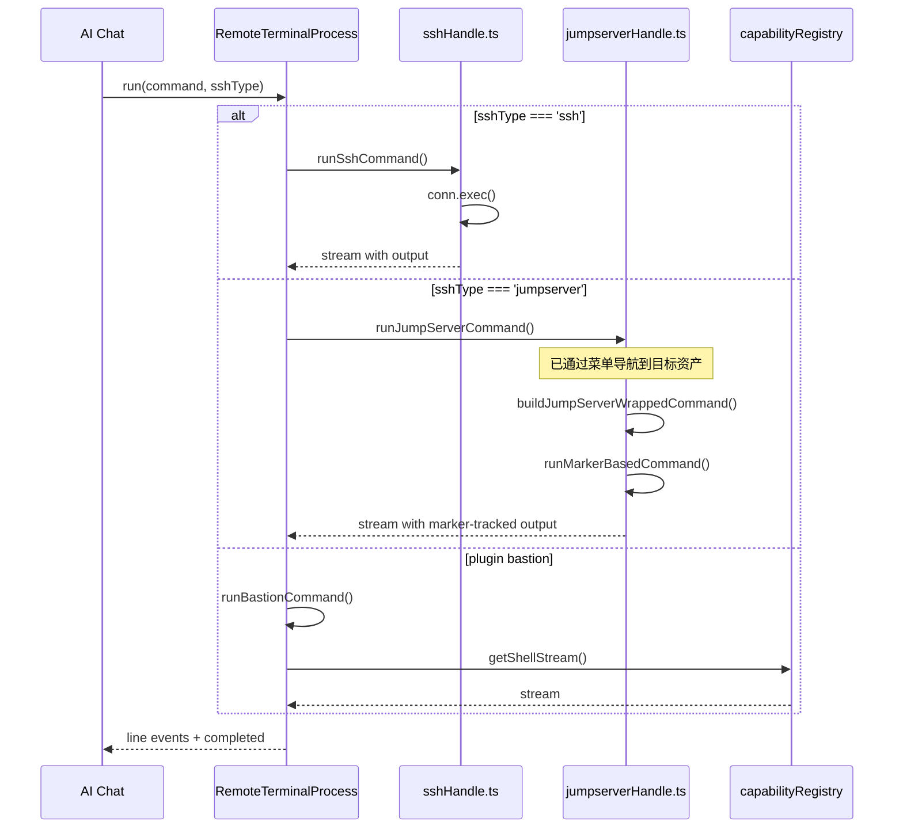

# SSH普通连接 vs 堡垒主机(JumpServer)连接在AI Chat中的使用分析

## 1. 核心架构差异

```mermaid
flowchart TB
    subgraph "普通SSH连接"
        A1["ssh:connect IPC"] --> A2["handleAttemptConnection"]
        A2 --> A3["sshConnections Map"]
        A3 --> A4["conn.shell() 创建Shell"]
        A4 --> A5["conn.exec() 执行命令"]
    end

    subgraph "JumpServer堡垒机连接"
        B1["ssh:connect IPC"] --> B2["handleJumpServerConnection"]
        B2 --> B3["attemptJumpServerConnection"]
        B3 --> B4["jumpserverConnections Map"]
        B4 --> B5["setupJumpServerInteraction<br/>菜单导航状态机"]
        B5 --> B6["jumpserverShellStreams Map"]
        B6 --> B7["createJumpServerExecStream<br/>独立Exec流"]
    end
```



## 2. AI Chat命令执行入口

文件: `src/main/agent/integrations/remote-terminal/index.ts:445`

```typescript
async run(sessionId: string, command: string, cwd?: string, sshType?: string): Promise<void> {
  if (resolvedType === 'jumpserver') {
    await this.runJumpServerCommand(sessionId, command, cwd)  // 堡垒机
  } else if (resolvedType === 'ssh') {
    await this.runSshCommand(sessionId, command, cwd)         // 普通SSH
  } else {
    await this.runBastionCommand(resolvedType, sessionId, command, cwd)  // 插件式堡垒机
  }
}
```

## 3. 关键差异对比

| 特性 | 普通SSH | JumpServer堡垒机 |
|------|---------|------------------|
| **连接建立** | 直接TCP连接到目标主机 | 先连接堡垒机，再通过菜单导航到目标资产 |
| **命令执行** | `conn.exec()` 直接执行 | 通过shell流 + 标记追踪 (marker-based) |
| **状态存储** | `sshConnections` | `jumpserverConnections` + `jumpserverShellStreams` |
| **复用机制** | `sshConnectionPool` (按host:port:username) | `findReusableConnection(assetUuid)` |
| **Shell管理** | 单一shell流 | 独立exec流用于AI命令执行 |
| **退出检测** | 标准EOF检测 | 特殊退出命令检测 + JumpServer prompt检测 |

## 4. 普通SSH命令执行

文件: `src/main/agent/integrations/remote-terminal/index.ts:572`

```typescript
private async runSshCommand(sessionId: string, command: string, cwd?: string): Promise<void> {
  // 1. 构建带工作目录的命令
  const commandToExecute = this.buildCommandWithWorkingDirectory(command, cleanCwd)

  // 2. 调用 agentHandle 执行
  const { remoteSshExecStream } = await import('../../../ssh/agentHandle')
  const stream = await remoteSshExecStream(sessionId, commandToExecute)

  // 3. 监听数据流
  stream.on('data', (data: Buffer) => { ... })
  stream.on('close', () => { ... })
}
```

## 5. JumpServer命令执行

文件: `src/main/agent/integrations/remote-terminal/index.ts:670`

```typescript
private async runJumpServerCommand(sessionId: string, command: string, cwd?: string): Promise<void> {
  // 1. 获取已导航好的shell流
  const stream = jumpserverShellStreams.get(sessionId)

  // 2. 使用Base64编码 + 标记追踪包装命令
  const { wrappedCommand, startMarker, endMarker } = this.buildJumpServerWrappedCommand(command, cleanCwd)

  // 3. 使用 marker-based-runner 执行并追踪结果
  await runMarkerBasedCommand({
    stream,
    wrappedCommand,
    startMarker,
    endMarker,
    timeoutMs: this.JUMPSERVER_COMMAND_TIMEOUT,
    ...
  })
}
```

## 6. 命令包装方式差异

### 普通SSH

直接执行命令，无需特殊包装:

```typescript
const commandToExecute = `cd ${cwd} && ${command}`
```

### JumpServer

使用Base64编码 + 标记追踪包装命令:

```typescript
const wrappedCommand = `bash -l -c 'echo "${startMarker}"; ${commandToExecute}; EXIT_CODE=$?; echo "${endMarker}:$EXIT_CODE"'`
```

**原因**: JumpServer环境下需要防止命令被菜单截获，Base64编码可隐藏命令内容，标记用于精确分割输出。

## 7. 连接复用机制差异

### 普通SSH

文件: `src/main/ssh/sshHandle.ts`

```typescript
const getConnectionPoolKey = (host, port, username) => `${host}:${port}:${username}`

// 只有MFA认证后的连接才能复用
if (reusableConn && reusableConn.hasMfaAuth) {
  // 复用连接
}
```

### JumpServer

文件: `src/main/ssh/jumpserverHandle.ts`

```typescript
const findReusableConnection = (jumpserverUuid?: string) => {
  // 通过assetUuid匹配可复用连接
  if (record?.jumpserverUuid === jumpserverUuid && record.conn) {
    // 跳过agent模式或未正确初始化的连接
    if (context?.source === 'agent' || context?.source === undefined) {
      continue
    }
    return { conn: record.conn }
  }
}
```

## 8. 流程时序图



## 9. 核心文件索引

| 功能 | 文件路径 |
|------|----------|
| AI Chat命令执行入口 | `src/main/agent/integrations/remote-terminal/index.ts` |
| 普通SSH处理 | `src/main/ssh/sshHandle.ts` |
| JumpServer处理 | `src/main/ssh/jumpserverHandle.ts` |
| JumpServer菜单导航 | `src/main/ssh/jumpserver/interaction.ts` |
| JumpServer连接管理 | `src/main/ssh/jumpserver/connectionManager.ts` |
| JumpServer流管理 | `src/main/ssh/jumpserver/streamManager.ts` |
| 插件式堡垒机注册 | `src/main/ssh/capabilityRegistry.ts` |
| 标记追踪执行器 | `src/main/agent/integrations/remote-terminal/marker-based-runner.ts` |

## 10. 总结

1. **普通SSH**: 简单直接，适合直连场景，AI命令通过`conn.exec()`直接执行

2. **JumpServer**: 两层连接架构，通过菜单导航到目标资产后，AI命令通过shell流+标记追踪方式执行

3. **插件式堡垒机**: 通过`CapabilityRegistry`动态扩展，接口标准化，执行方式类似JumpServer

4. **AI Chat统一入口**: `RemoteTerminalProcess.run()`根据`sshType`路由到不同实现，AI无需关心底层差异
