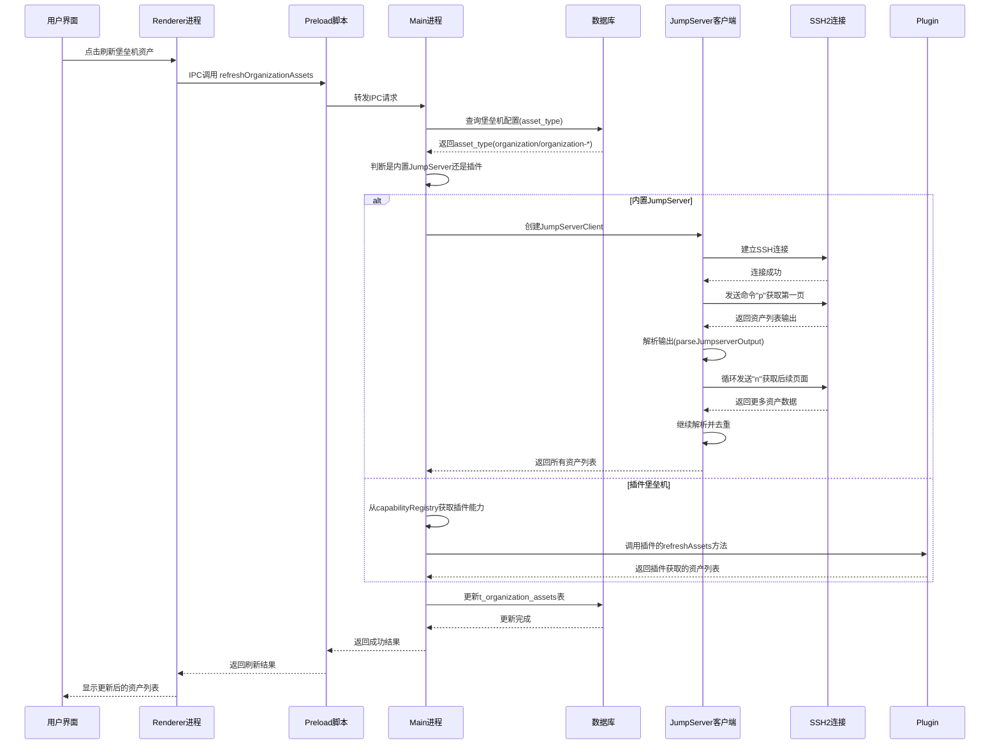

# JumpServer 堡垒机资产获取机制分析

## 概述

Chaterm 通过内置的 JumpServer 客户端和插件化架构，实现了对堡垒机可连接 SSH 资产的自动发现和管理。系统支持两种模式：
1. **内置 JumpServer 支持** - 直接与标准 JumpServer 交互
2. **插件化堡垒机支持** - 通过插件扩展支持其他堡垒机系统（如奇安信、腾讯云等）

## 架构流程图



## 核心组件分析

### 1. 资产获取主入口

**文件**: `src/main/storage/db/chaterm/assets.organization.ts`
**函数**: `refreshOrganizationAssetsLogic`

#### 资产类型识别
系统通过 `asset_type` 字段区分不同类型的堡垒机：
- `organization` - 内置 JumpServer 支持
- `organization-{type}` - 插件化堡垒机（如 `organization-qizhi`, `organization-tencent`）

#### 类型提取函数
```typescript
function extractBastionType(assetType: string): string {
  if (assetType === 'organization') {
    return 'jumpserver'  // 内置JumpServer
  }
  if (assetType.startsWith('organization-')) {
    return assetType.replace('organization-', '')  // 插件类型
  }
  return 'jumpserver'
}
```

### 2. 内置 JumpServer 资产获取流程

**文件**: `src/main/ssh/jumpserver/asset.ts`
**类**: `JumpServerClient`

#### 连接建立
1. **创建 JumpServerClient**: 使用 SSH2 库建立到 JumpServer 的连接
2. **认证方式**: 支持密钥认证和密码认证，包含 MFA（多因素认证）支持
3. **持久化 Shell**: 建立持久化的 Shell 会话用于后续命令执行

#### 资产抓取过程
1. **初始命令**: 发送 `p` 命令获取第一页资产列表
2. **分页处理**: 循环发送 `n` 命令获取后续页面，最多 100 页
3. **超时控制**: 每页最多 15 秒，总时间限制 5 分钟
4. **错误处理**: 支持重试和连续失败检测

#### 输出解析
**文件**: `src/main/ssh/jumpserver/parser.ts`
**函数**: `parseJumpserverOutput`

- **资产表格识别**: 自动识别中英文表头（ID|名称|地址|平台|组织|备注）
- **分页信息提取**: 识别"页码：X 总页数：Y"或"Page: X Total Page: Y"
- **数据结构**: 返回标准化的 Asset 对象数组

```typescript
interface Asset {
  id: number
  name: string      // 主机名
  address: string   // IP地址
  platform: string  // 平台类型
  organization: string // 所属组织
  comment: string   // 备注信息
}
```

### 3. 插件化堡垒机资产获取

**文件**: `src/main/ssh/capabilityRegistry.ts`
**类**: `CapabilityRegistry`

#### 能力注册
- **注册中心**: `capabilityRegistry`
- **插件接口**: 通过 `registerBastionCapability()` 注册插件能力
- **定义元数据**: 通过 `registerBastionDefinition()` 注册插件元数据

#### 资产刷新调用
```typescript
const bastionCapability = capabilityRegistry.getBastion(bastionType)
const capabilityResult = await bastionCapability.refreshAssets({
  organizationUuid,
  host: finalConfig.host,
  port: finalConfig.port,
  username: finalConfig.username,
  // ... 其他认证参数
})
```

#### 插件要求
插件必须实现 `refreshAssets` 方法，返回标准化的资产格式：
```typescript
{
  success: boolean,
  assets?: Array<{
    hostname: string,
    host: string,
    comment?: string
  }>,
  error?: string
}
```

### 4. 数据库存储

**表结构**:
- **主表**: `t_assets` - 存储堡垒机主机配置
- **资产表**: `t_organization_assets` - 存储从堡垒机获取的具体资产

**关键字段**:
- `jump_server_type` - 存储堡垒机类型
- `bastion_comment` - 存储资产备注
- `organization_uuid` - 关联到堡垒机主机

#### 数据同步
1. **增量更新**: 只更新已存在的资产记录
2. **新增插入**: 为新发现的资产创建记录
3. **清理删除**: 删除不再存在的资产记录
4. **去重处理**: 基于 host 地址去重，避免重复资产

### 5. 前端展示

**文件**: `src/main/storage/db/chaterm/assets.organization.ts`
**函数**: `getUserHostsLogic` - 获取所有可连接的主机列表

#### 资产查询特性
- **树形结构**: 将堡垒机作为父节点，其下资产作为子节点
- **搜索支持**: 支持按主机名/IP 搜索资产
- **分页限制**: 最多返回 50 个结果，保持 UI 响应性

#### UI 集成
- **连接逻辑**: `connectAssetInfoLogic` - 获取资产连接信息
- **类型路由**: 根据 `sshType` 字段路由到正确的连接处理器
- **状态管理**: 通过 Pinia Store 管理资产状态

## 安全特性

### 认证安全
- **密钥保护**: 私钥从数据库安全读取，不在内存中明文存储
- **MFA 支持**: 完整的键盘交互式认证支持
- **连接标识**: 包含应用版本信息用于审计

### 错误处理
- **标准化错误**: 使用 `BastionErrorCode` 枚举统一错误码
- **安全日志**: 敏感信息（如私钥）在日志中被隐藏
- **连接清理**: 异常情况下确保 SSH 连接正确关闭

## 插件开发指南

### 插件清单配置 (plugin.json)
```json
{
  "id": "jumpserver-support",
  "displayName": "JumpServer Support",
  "version": "1.0.0",
  "description": "JumpServer integration plugin",
  "main": "index.js",
  "type": "bastion",
  "contributes": {
    "views": [
      {
        "id": "jumpserver-view",
        "name": "JumpServer",
        "icon": "assets/icon.svg"
      }
    ]
  }
}
```

### 堡垒定义配置
```typescript
const definition: BastionDefinition = {
  type: 'jumpserver',
  version: 1,
  displayNameKey: 'bastion.jumpserver.name',
  assetTypePrefix: 'organization-jumpserver',
  authPolicy: ['password', 'keyBased'],
  supportsRefresh: true,
  supportsShellStream: true,
  agentExec: 'stream'
}
```

### 插件开发示例
```typescript
// 插件主文件 index.js
module.exports = {
  async register(host) {
    // 注册堡垒定义
    host.registerBastionDefinition({
      type: 'my-bastion',
      version: 1,
      displayNameKey: 'bastion.mybastion.name',
      assetTypePrefix: 'organization-mybastion',
      authPolicy: ['password'],
      supportsRefresh: false,
      supportsShellStream: true,
      agentExec: 'stream'
    });

    // 注册堡垒能力
    host.registerBastionCapability({
      type: 'my-bastion',
      async connect(connectionInfo, event) {
        // 实现连接逻辑
        return { status: 'connected', sessionId: 'session-123' };
      },
      async shell(event, args) {
        // 实现Shell会话
        return { status: 'success' };
      },
      write(args) {
        // 实现数据写入
      },
      async resize(args) {
        // 实现终端调整
      },
      async disconnect(args) {
        // 实现断开连接
      }
    });
  }
};
```

## 总结

Chaterm 的 JumpServer 资产获取机制具有以下优势：

1. **灵活性**: 支持内置 JumpServer 和插件化扩展
2. **安全性**: 完整的认证和错误处理机制
3. **可靠性**: 健壮的分页处理和超时控制
4. **可维护性**: 清晰的模块化架构和标准化接口
5. **用户体验**: 无缝的资产同步和直观的 UI 展示

该设计为用户提供了统一的堡垒机资产管理体验，同时为开发者提供了清晰的插件扩展接口。