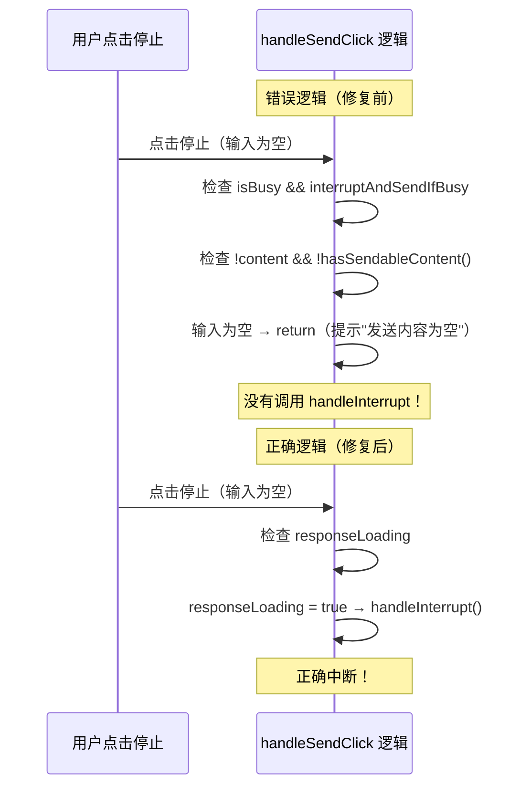

# AI Chat 中断任务按钮问题修复计划

## 问题描述

在 AI Chat 中，当 AI 正在响应时，点击中断任务按钮（stop 图标）无法正常中断任务，而是提示"发送内容为空，请输入内容"。

## 问题分析

### 调用流程图



### 根本原因

在 `handleSendClick` 中，当 `responseLoading = true`（AI 正在响应）时，`isBusy` 也为 true。原来的逻辑先检查 `isBusy && interruptAndSendIfBusy`，此时如果输入为空（没有 content 且没有可发送内容），就直接 return 并提示"发送内容为空"，根本没有机会调用 `handleInterrupt` 中断任务。

## 修复方案

调整条件顺序，**优先检查 `responseLoading`**，确保 AI 正在响应时无论输入是否为空都先执行中断：

```typescript
// 优先处理 AI 响应中的中断：当 AI 正在响应时，无论输入是否为空都先中断
if (responseLoading.value) {
  await props.handleInterrupt()
  return
}
```

## 计划任务

- [x] 1. 调整 `handleSendClick` 中的条件顺序，优先检查 `responseLoading`
- [x] 2. 运行测试验证修复

## Review 总结

### 修改内容

修改了 `src/renderer/src/views/components/AiTab/components/InputSendContainer.vue` 的 `handleSendClick` 函数：

1. 将 `responseLoading.value` 检查**提前**到最前面
2. 添加了 `await` 关键字确保异步操作完成

### 关键修改位置

- `src/renderer/src/views/components/AiTab/components/InputSendContainer.vue` 第325-329行

### 为什么这样修复

当 AI 正在响应时（`responseLoading = true`），用户的本意是点击停止按钮中断任务。此时应该**立即**执行中断逻辑，而不是检查输入内容是否为空。原来的逻辑把 `isBusy` 检查放在前面，导致输入为空时直接 return。

### 测试结果

所有 19 个 useCommandInteraction 测试全部通过。

## 相关文件

- `src/renderer/src/views/components/AiTab/composables/useCommandInteraction.ts` - handleCancel 实现
- `src/renderer/src/views/components/AiTab/components/InputSendContainer.vue` - 按钮调用处
