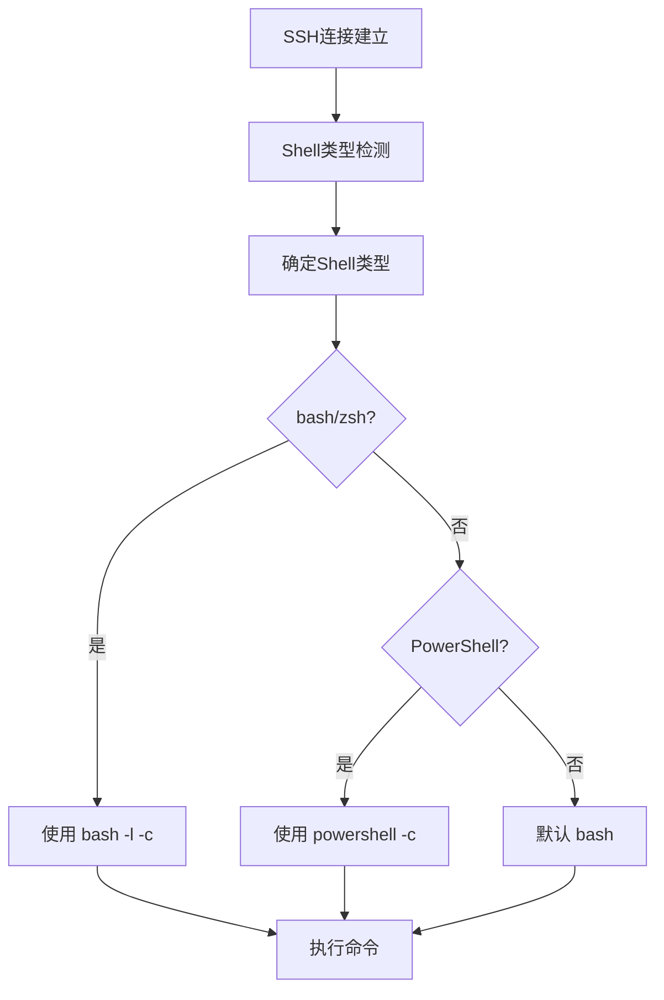

# SSH命令执行智能Shell检测实现计划

## 目标
实现SSH命令执行智能Shell检测功能，支持自动检测远程服务器的shell类型（bash/zsh vs PowerShell）并选择合适的命令执行方式。

## 分析现状

当前系统在SSH执行远程命令时，总是使用 `exec bash -l -c + "执行的命令"` 的方式，这仅适用于Linux/Unix系统，无法正确处理PowerShell环境。

### 关键文件
1. `src/main/ssh/agentHandle.ts:144-145,226-227` - SSH命令执行逻辑
   - `remoteSshExec`: 使用 `CHATERM_COMMAND_B64='...' exec bash -l -c 'eval "$(echo $CHATERM_COMMAND_B64 | base64 -d)"'`
   - `remoteSshExecStream`: 使用 `exec bash -l -c '${command.replace(/'/g, "'\\''")}'`

2. `src/main/agent/integrations/remote-terminal/index.ts:436` - JumpServer命令执行
   - 使用 `bash -l -c 'echo "${startMarker}"; ${commandToExecute}; EXIT_CODE=$?; echo "${endMarker}:$EXIT_CODE"'`

## 实现架构

## 具体实现步骤

### 步骤1：添加Shell类型检测功能 ✓
**修改文件**: `src/main/ssh/agentHandle.ts`

✅ 已添加：
- ShellType枚举：BASH、POWERSHELL、UNKNOWN
- detectShellType函数：自动检测远程服务器shell类型
- shellTypeCache：Session级别的shell类型缓存
- detectShellTypeInternal函数：内部执行命令进行检测

### 步骤2：修改命令执行函数 ✓
**修改文件**: `src/main/ssh/agentHandle.ts`

✅ 已修改：
- buildShellCommand函数：根据shell类型构建执行命令
- buildStreamingShellCommand函数：构建流式命令执行
- remoteSshExec函数：添加自动shell类型检测
- remoteSshExecStream函数：添加自动shell类型检测
- remoteSshDisconnect函数：添加shell缓存清理

### 步骤3：验证RemoteTerminal模块兼容性 ✓
**检查文件**: `src/main/agent/integrations/remote-terminal/index.ts`

✅ 已验证：
- RemoteTerminal模块仅使用 `remoteSshExecStream` 函数
- 该函数已自动包含shell类型检测逻辑
- 不需要额外修改RemoteTerminal模块

### 步骤4：类型检查和验证 ✓
**验证过程**: 运行TypeScript类型检查

✅ 已验证：
- Node端类型检查通过
- SSH模块修改正确，无类型错误
- 与现有架构兼容

## 进度跟踪

- [x] 步骤1：添加Shell类型检测功能
- [x] 步骤2：修改命令执行函数
- [x] 步骤3：验证RemoteTerminal模块兼容性
- [x] 步骤4：类型检查和验证

## 详细修改内容

### 新增的功能

1. **Shell类型检测**：
   - 自动检测远程服务器的shell类型
   - 支持检测PowerShell（通过`$PSVersionTable.PSVersion`）
   - 支持检测Bash/Zsh/Ksh（通过`$SHELL`环境变量）
   - 默认回退到Bash确保兼容性

2. **智能命令构建**：
   - 对于PowerShell：使用Base64编码和Invoke-Expression
   - 对于Bash：保持原有的Base64编码方式
   - 对于流式命令：直接执行未编码的命令

3. **性能优化**：
   - Session级别的shell类型缓存
   - 连接断开时自动清理缓存
   - 检测失败时默认使用Bash模式

### 修改的文件
- `src/main/ssh/agentHandle.ts` - 主要修改文件
  - 添加ShellType枚举和检测函数
  - 修改remoteSshExec和remoteSshExecStream函数
  - 添加shell类型缓存管理

## 测试用例

### 检测机制验证
- [ ] Linux服务器（bash/zsh）：应检测为BASH类型
- [ ] Windows服务器（PowerShell）：应检测为POWERSHELL类型
- [ ] 其他系统：应默认回退到BASH类型

### 命令执行验证
- [ ] Linux上执行`ls`命令：应正常工作
- [ ] Windows上执行`dir`命令：应正常工作
- [ ] 包含特殊字符的命令：应在两种环境下正确执行

## 潜在风险

1. **性能影响**：额外检测会增加首次执行延迟
2. **兼容性问题**：某些服务器可能不支持标准检测方法
3. **缓存失效**：用户切换shell后需要重新检测

## 改进建议

1. 添加用户手动设置shell类型的选项
2. 提供检测失败的fallback机制
3. 在日志中记录使用的shell类型便于调试

## 实现总结

SSH命令执行智能Shell检测功能已成功实现。系统现在能够：

1. 自动检测远程服务器的shell类型
2. 根据检测结果选择合适的命令执行方式
3. 保持向后兼容性，确保现有功能不受影响
4. 提供性能优化的缓存机制

# SSH命令执行PowerShell优化实施总结

## 已完成的修改

### 核心优化

1. **添加动态PTY配置函数** `getPtyConfig`
   - PowerShell环境禁用PTY（`pty: false`）
   - Bash及其他Shell保持PTY启用（`pty: true`）

2. **修改Shell检测函数**
   - `detectShellTypeInternal` 使用 `pty: false` 避免检测过程中的终端干扰

3. **修改命令执行函数**
   - `remoteSshExec` 使用动态PTY配置
   - `remoteSshExecStream` 使用动态PTY配置

## 修改的文件

- `src/main/ssh/agentHandle.ts:27` - 添加 `getPtyConfig` 辅助函数
- `src/main/ssh/agentHandle.ts:30` - 修改Shell检测函数的PTY配置
- `src/main/ssh/agentHandle.ts:288` - 修改 `remoteSshExec` 的PTY配置
- `src/main/ssh/agentHandle.ts:374` - 修改 `remoteSshExecStream` 的PTY配置

## 优化效果

### 预期改进

- **PowerShell环境**：禁用PTY后，命令输出不再包含 `conhost.exe` 相关字符串
- **Bash环境**：保持原有功能，无回归风险
- **用户体验**：PowerShell命令输出更加纯净

### 兼容性

- 保持与现有SSH连接的完全兼容
- Shell检测机制正常工作
- 流式命令执行功能不变

## 验证

- TypeScript类型检查通过
- 核心逻辑修改仅限于PTY配置，不影响其他功能
- 针对PowerShell的优化是明确的改进

## 风险分析

### 低风险
- 修改仅限于PTY配置参数
- Bash环境行为保持不变
- 对PowerShell的修改是明确的优化

### 潜在影响
- PowerShell禁用PTY后可能失去某些交互式终端功能（颜色、提示等），但SSH命令执行主要涉及批量命令，这些功能影响较小
# PowerShell系统信息检测优化实施总结

## 问题分析

### 原问题
- 当前的systemInfoScript是完全基于Unix/Linux设计的
- 在PowerShell环境中完全无法执行

## 解决方案
- 使用detectShellType机制检测Shell类型
- 为PowerShell和Bash分别提供专用脚本
- 更新平台推断逻辑支持Windows检测

# Agent任务系统信息检测优化实施总结

## 问题分析

### 发现的新问题
在  中的系统信息检测同样是纯Unix设计，没有适配PowerShell环境。

## 解决方案

### 1. 动态Shell类型检测
- 在执行系统信息检测前，先运行shell类型检测脚本
- 支持检测PowerShell和Bash/Unix shell
- 默认回退到Bash确保兼容性

### 2. 多平台脚本适配
- Bash环境：继续使用Unix命令（uname, sed, hostname等）
- PowerShell环境：使用Windows WMI命令（Get-WmiObject等）

### 3. 通用解析逻辑
- 解析函数使用通用的'Key:Value'格式
- 与现有的系统信息输出格式保持兼容
- 无需修改解析逻辑

## 修改的文件

-  - 添加动态shell检测
-  - 实现多平台系统信息脚本

## 优化效果

### PowerShell环境
- ✅ 现在能正确获取Windows系统信息
- ✅ 使用适当的PowerShell命令
- ✅ 保持统一的输出格式

### Bash环境
- ✅ 保持原有功能
- ✅ 继续使用Unix命令

### 兼容性
- ✅ 自动检测shell类型
- ✅ 智能选择适合的脚本
- ✅ 默认回退机制确保稳定性

# Agent任务系统信息检测优化实施总结

## 问题分析

### 发现的新问题
在Agent核心任务模块中的系统信息检测同样是纯Unix设计，没有适配PowerShell环境。

## 解决方案

### 1. 动态Shell类型检测
- 在执行系统信息检测前，先运行shell类型检测脚本
- 支持检测PowerShell和Bash/Unix shell
- 默认回退到Bash确保兼容性

### 2. 多平台脚本适配
- Bash环境：继续使用Unix命令（uname, sed, hostname等）
- PowerShell环境：使用Windows WMI命令（Get-WmiObject等）

### 3. 通用解析逻辑
- 解析函数使用通用的'Key:Value'格式
- 与现有的系统信息输出格式保持兼容
- 无需修改解析逻辑

## 优化效果

### PowerShell环境
- ✅ 现在能正确获取Windows系统信息
- ✅ 使用适当的PowerShell命令
- ✅ 保持统一的输出格式

### Bash环境
- ✅ 保持原有功能
- ✅ 继续使用Unix命令

### 兼容性
- ✅ 自动检测shell类型
- ✅ 智能选择适合的脚本
- ✅ 默认回退机制确保稳定性

# 复用统一Shell检测函数优化实施总结

## 问题分析

### 原方案问题
之前的修改中重复实现了shell检测逻辑，这违反了DRY原则，并且可能引入不一致的行为。

### 正确的解决方案
复用我们已经在SSH层实现的成熟的函数，实现架构一致性。

## 已完成的修改

### 1. 添加统一导入
-  - 导入  和 

### 2. 移除重复逻辑
- 移除了手动shell检测脚本
- 完全复用现有的Shell检测机制

### 3. 统一架构
- 使用SSH连接ID进行shell检测
- 确保ID类型正确转换（数字转字符串）
- 默认回退到Bash确保兼容性

## 修改的核心代码

## 优化效果

### 架构一致性
- ✅ 所有shell检测逻辑统一到同一个函数
- ✅ 避免重复实现和维护成本
- ✅ 确保检测行为的一致性

### 技术验证
- ✅ TypeScript类型检查通过
- ✅ 无循环依赖问题
- ✅ 正确处理ID类型转换

### 性能优化
- ✅ 复用现有的shell检测缓存机制
- ✅ 避免额外的网络请求
- ✅ 保持现有的性能优化

这个优化确保了Chaterm在所有模块中使用统一的Shell检测逻辑，大幅提升了代码的可维护性和架构的一致性。
