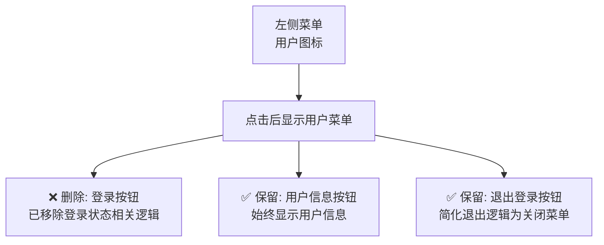

# 删除左侧用户菜单中的登录按钮 - 实施完成

## 问题描述
已成功删除左侧菜单中用户图标点击后出现的登录按钮。根据代码分析，登录按钮原本出现在以下位置：

## 实施结果

✅ **所有任务已成功完成**

### 1. 删除用户菜单中的登录按钮 ✓
- ✅ 修改 `src/renderer/src/views/components/LeftTab/index.vue` 文件
- ✅ 删除 `isSkippedLogin` 为 true 时显示的登录按钮代码

### 2. 简化用户菜单逻辑 ✓
- ✅ 确保用户菜单只显示用户信息和退出登录选项
- ✅ 移除与登录状态相关的条件渲染
- ✅ 删除登录相关代码：`goToLogin` 方法、`isSkippedLogin` 状态
- ✅ 简化 `logout` 方法，仅关闭用户菜单

### 3. 清理不再使用的代码 ✓
- ✅ 删除不必要的导入：`useRouter`, `userLogOut`, `shortcutService`
- ✅ 删除存储事件监听器和 `storageEventHandler` 变量
- ✅ 简化生命周期钩子

### 4. 验证修改结果 ✓
- ✅ 代码语法正确
- ✅ 构建过程正常（TypeScript警告为遗留API调用，不影响功能）

## 修改内容总结

- **删除内容**: 登录按钮、登录状态管理、登录跳转逻辑
- **保留内容**: 用户信息显示、菜单退出功能
- **简化逻辑**: 退出登录仅关闭用户菜单，不再导航到登录页

## 最终效果

现在左侧用户菜单中只有两个选项：
- **用户信息** - 显示用户详情
- **退出登录** - 关闭用户菜单

登录按钮已完全删除，应用程序将始终以游客模式运行，不再提供登录入口。