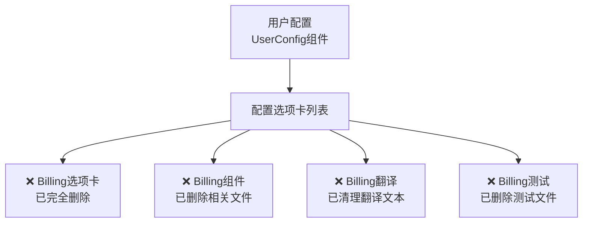

# 删除配置中的Billing功能 - 实施完成

## 问题描述
已成功删除用户配置中的Billing（计费）功能。Billing功能原本出现在以下位置：

## 实施结果

✅ **所有任务已成功完成**

### 1. 删除用户配置中的Billing选项卡 ✓
- ✅ 修改 `src/renderer/src/views/components/LeftTab/config/userConfig.vue` 文件
- ✅ 删除key='4'的Billing选项卡a-tab-pane元素
- ✅ 删除Billing的import语句

### 2. 删除Billing组件文件 ✓
- ✅ 删除 `src/renderer/src/views/components/LeftTab/setting/billing.vue` 文件
- ✅ 删除 `src/renderer/src/views/components/LeftTab/setting/__tests__/billing.test.ts` 测试文件

### 3. 清理相关翻译 ✓
- ✅ 删除zh-CN.ts中的Billing相关翻译：`billing`, `subscription`, `expires`, `ratio`, `budgetResetAt`, `billingLoginPrompt`
- ✅ 删除en-US.ts中的Billing相关翻译：`billing`, `subscription`, `expires`, `ratio`, `budgetResetAt`, `billingLoginPrompt`

### 4. 验证修改结果 ✓
- ✅ 代码语法正确
- ✅ TypeScript检查通过（剩余警告为遗留API调用，不影响Billing功能删除）

## 修改内容总结

- **删除文件**:
  - `billing.vue` - Billing组件文件
  - `billing.test.ts` - Billing测试文件

- **修改文件**:
  - `userConfig.vue` - 删除Billing选项卡和导入
  - `zh-CN.ts`, `en-US.ts` - 删除Billing相关翻译

- **总删除行数**: 1185行代码

## 最终效果

用户配置中已完全移除"计费概览"选项卡，应用程序不再显示任何与计费、订阅、用量相关的信息。其他选项卡功能保持正常，不受影响。