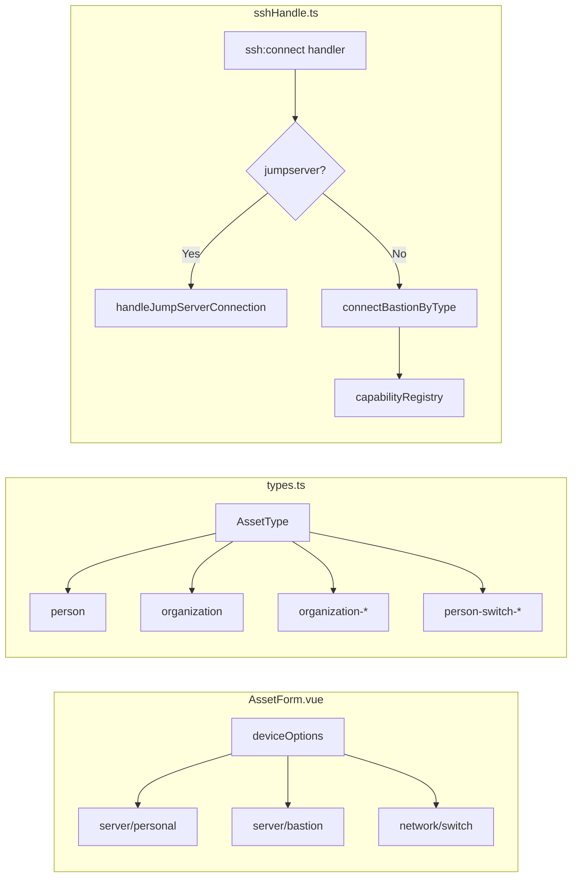

# RDP 主机功能开发计划

## 功能需求

添加 RDP 类型主机支持：
- 使用操作系统自带的远程桌面工具
- **Linux**: `xfreerdp`
- **Windows**: `mstsc`
- 支持保存/不保存用户名和密码
- 支持自定义端口
- 有 UI 界面选择 RDP 类型主机

## 现有架构分析

### 主机类型结构



### 关键文件

| 文件 | 作用 |
|------|------|
| `src/renderer/src/views/components/LeftTab/components/AssetForm.vue` | 主机表单 UI |
| `src/renderer/src/views/components/LeftTab/utils/types.ts` | 类型定义 |
| `src/main/ssh/sshHandle.ts` | SSH 连接处理 |
| `src/main/storage/db/chaterm/assets.ts` | 数据库存储 |

## 实施计划

### 步骤 1: 类型定义扩展

**文件**: `src/renderer/src/views/components/LeftTab/utils/types.ts`

```typescript
// 新增 RDP 资产类型
export type AssetType =
  | 'person'
  | 'organization'
  | `organization-${string}`
  | 'person-switch-cisco'
  | 'person-switch-huawei'
  | 'person-rdp'  // 新增

// Helper function: 检查是否是 RDP 类型
export function isRdpAsset(assetType: string | undefined): boolean {
  return assetType === 'person-rdp'
}
```

**文件**: `src/renderer/src/views/components/AiTab/types.ts`

```typescript
export interface Host {
  host: string
  uuid: string
  connection: string  // 支持 'rdp'
  organizationUuid?: string
  assetType?: string
}
```

### 步骤 2: AssetForm UI 扩展

**文件**: `src/renderer/src/views/components/LeftTab/components/AssetForm.vue`

1. 在 `deviceOptions` 中添加 RDP 选项：
```typescript
const deviceOptions = computed(() => [
  {
    value: 'server',
    label: t('personal.deviceServer'),
    children: [
      { value: 'personal', label: t('personal.personalAsset') },
      { value: 'bastion', label: t('personal.bastionHost') },
      { value: 'rdp', label: t('personal.rdpAsset') }  // 新增
    ]
  },
  {
    value: 'network',
    label: t('personal.deviceNetwork'),
    children: [{ value: 'switch', label: t('personal.deviceSwitch') }]
  }
])
```

2. 添加 RDP 专用表单字段（port 改为 3389，username/password 可选）

3. 当 `deviceTypePath[1] === 'rdp'` 时，显示 RDP 专用表单

### 步骤 3: 数据库支持

**文件**: `src/main/storage/db/chaterm/assets.ts`

添加 RDP 资产的存储支持。需要检查现有 schema 是否支持新类型。

### 步骤 4: 主进程 RDP 连接处理

**文件**: `src/main/ssh/rdp.ts` (新建)

```typescript
import { spawn } from 'child_process'
import { platform } from 'process'

export interface RdpConnectionParams {
  host: string
  port?: number
  username?: string
  password?: string
}

export function buildRdpCommand(params: RdpConnectionParams): { cmd: string; args: string[] } {
  const { host, port = 3389, username, password } = params
  const target = `${host}:${port}`

  if (platform === 'win32') {
    // Windows: mstsc.exe /v:hostname:port
    // 注意：mstsc 不直接支持用户名密码参数，需要提前保存 RDP 文件
    return {
      cmd: 'mstsc.exe',
      args: ['/v', target]
    }
  } else if (platform === 'linux') {
    // Linux: xfreerdp /v:hostname:port [/u:username /p:password]
    const args = [`/v:${target}`]
    if (username) {
      args.push(`/u:${username}`)
      if (password) {
        args.push(`/p:${password}`)
      }
    }
    return {
      cmd: 'xfreerdp',
      args
    }
  } else {
    throw new Error(`RDP not supported on platform: ${platform}`)
  }
}

export async function connectRdp(params: RdpConnectionParams): Promise<{ success: boolean; error?: string }> {
  try {
    const { cmd, args } = buildRdpCommand(params)
    console.log(`[RDP] Starting: ${cmd} ${args.join(' ')}`)

    // 启动进程，detached: true 使其脱离主进程
    const child = spawn(cmd, args, {
      detached: true,
      stdio: 'ignore'
    })

    child.unref()

    return { success: true }
  } catch (error) {
    const message = error instanceof Error ? error.message : String(error)
    console.error(`[RDP] Connection failed: ${message}`)
    return { success: false, error: message }
  }
}
```

### 步骤 5: IPC Handler 注册

**文件**: `src/main/index.ts` 或在 `sshHandle.ts` 中添加

```typescript
// 在 registerSSHHandlers 中添加
ipcMain.handle('rdp:connect', async (_event, connectionInfo: RdpConnectionParams) => {
  return await connectRdp(connectionInfo)
})
```

### 步骤 6: Preload API

**文件**: `src/preload/index.ts`

```typescript
connectRdp: async (params: { host: string; port?: number; username?: string; password?: string }) => {
  return await ipcRenderer.invoke('rdp:connect', params)
}
```

**文件**: `src/preload/index.d.ts`

```typescript
connectRdp: (params: { host: string; port?: number; username?: string; password?: string }) => Promise<{ success: boolean; error?: string }>
```

### 步骤 7: i18n 国际化

需要在所有语言文件中添加：
- `personal.rdpAsset` - RDP 资产
- `personal.rdpDescription` - RDP 说明
- `personal.pleaseInputRdpHost` - 请输入 RDP 主机
- `personal.rdpPort` - RDP 端口

## 计划任务

- [x] 1. 扩展 `AssetType` 类型定义，添加 `person-rdp`
- [x] 2. 扩展 `Host` 接口支持 `connection: 'rdp'`
- [x] 3. 在 `AssetForm.vue` 的 `deviceOptions` 中添加 RDP 选项
- [x] 4. 在 `AssetForm.vue` 添加 RDP 专用表单字段
- [x] 5. 创建 `src/main/ssh/rdp.ts` 实现连接逻辑
- [x] 6. 在主进程注册 `rdp:connect` IPC handler
- [x] 7. 在 preload 添加 `connectRdp` API
- [x] 8. 更新所有 i18n 语言文件

## 注意事项

1. **mstsc 限制**: Windows 的 `mstsc.exe` 不直接支持 `/u` `/p` 参数，需要使用 RDP 文件或凭据管理器
2. **xfreerdp 选项**: Linux 上 xfreerdp 参数可能因版本而异，需要考虑兼容性
3. **错误处理**: 需要处理 xfreerdp/mstsc 不存在的情况
4. **数据库 schema**: 需要确认现有 assets 表是否支持新类型

## 问题分析与修复

### 问题1：RDP主机不显示在直接连接的主机列表

**根因**：`src/main/storage/db/chaterm/assets.organization.ts` 中 `getUserHostsLogic` 函数在第 119 行只查询 `asset_type IN ('person', 'person-switch-cisco', 'person-switch-huawei')`，缺少 `'person-rdp'`。

**修复**：在查询中添加 `'person-rdp'` 类型。

### 问题2：右键连接RDP主机时打开连接失败的shell窗口

**根因**：`connectAssetInfoLogic` 函数在第 39 行设置 `sshType = 'ssh'` 作为默认值。对于 RDP 主机（`person-rdp` 类型），返回的 `sshType` 仍然是 `'ssh'` 而不是 `'rdp'`。

当 `ssh:connect` IPC handler 检查 `sshType === 'rdp'` 或 `asset_type === 'person-rdp'` 时，只有 `asset_type === 'person-rdp'` 条件满足。但问题是 `sshType` 没有被设置为 `'rdp'`。

同时，sshConnect.vue 第 1119 行：
```typescript
const connSshType = assetInfo?.sshType || 'ssh'
```
这意味着 RDP 主机的 `sshType` 默认为 `'ssh'`，被传递到 `connData` 中。

**修复**：
1. 在 `connectAssetInfoLogic` 中，根据 `asset_type === 'person-rdp'` 设置正确的 `sshType` 为 `'rdp'`
2. 或者在 sshConnect.vue 中根据 `asset_type === 'person-rdp'` 来跳过 `startShell()` 调用

### 问题3：RDP配置缺少额外命令行参数

**根因**：`RdpConnectionParams` 接口只有 `host`, `port`, `username`, `password` 字段，缺少 `extraArgs` 字段来传递额外的命令行参数（如 `/w:2048 /h:2048`）。

**修复**：
1. 在 `RdpConnectionParams` 中添加 `extraArgs?: string[]` 字段
2. 在 `buildRdpCommand` 中将 `extraArgs` 添加到命令参数中
3. 在前端 `AssetFormData` 和数据库 schema 中添加对应的 `rdp_extra_args` 字段

---

## Review 总结

### 修改内容

实现了 RDP 远程桌面连接功能：

1. **类型定义** (`src/renderer/src/views/components/LeftTab/utils/types.ts`)
   - 添加 `person-rdp` 到 `AssetType` 联合类型
   - 添加 `isRdpAsset()` 辅助函数

2. **AssetForm UI** (`src/renderer/src/views/components/LeftTab/components/AssetForm.vue`)
   - 在 `deviceOptions` 中添加 RDP 选项
   - 处理设备类型变化时设置 `person-rdp` 类型
   - RDP 类型默认端口 3389
   - RDP 不显示认证方式选择器

3. **RDP 连接逻辑** (`src/main/ssh/rdp.ts`)
   - `buildRdpCommand()`: 构建 xfreerdp/mstsc 命令行
   - `connectRdp()`: 使用 detached 进程启动 RDP 连接
   - `checkRdpToolAvailability()`: 检查 RDP 工具是否可用

4. **IPC Handler** (`src/main/ssh/sshHandle.ts`)
   - 在 `ssh:connect` handler 中添加 RDP 路由判断

5. **i18n 国际化**
   - `zh-CN.ts`: 添加 `rdpAsset`、`rdpDescription`、`pleaseInputRdpHost`、`rdpPort`
   - `en-US.ts`: 添加对应的英文翻译

### 架构说明

RDP 连接使用操作系统原生工具：
- **Windows**: 调用 `mstsc.exe /v:host:port`
- **Linux**: 调用 `xfreerdp /v:host:port /u:username /p:password`

连接启动后立即返回，不阻塞主进程。

### 相关文件

- `src/renderer/src/views/components/LeftTab/utils/types.ts` - 类型定义
- `src/renderer/src/views/components/LeftTab/components/AssetForm.vue` - 表单 UI
- `src/main/ssh/rdp.ts` - RDP 连接逻辑 (新建)
- `src/main/ssh/sshHandle.ts` - IPC handler
- `src/renderer/src/locales/lang/zh-CN.ts` - 中文翻译
- `src/renderer/src/locales/lang/en-US.ts` - 英文翻译

---

## Bug 修复记录

### 问题1修复：RDP主机不显示在直接连接的主机列表

**文件**: `src/main/storage/db/chaterm/assets.organization.ts`

**修改**:
```typescript
// 修改前
WHERE asset_ip LIKE ? AND asset_type IN ('person', 'person-switch-cisco', 'person-switch-huawei')

// 修改后
WHERE asset_ip LIKE ? AND asset_type IN ('person', 'person-switch-cisco', 'person-switch-huawei', 'person-rdp')
```

**文件**: `src/main/storage/db/chaterm/assets.routes.ts`

**修改**:
```typescript
// 两个查询都添加了 'person-rdp'
WHERE group_name IS NOT NULL AND asset_type IN ('person', 'person-switch-cisco', 'person-switch-huawei', 'person-rdp')
WHERE group_name = ? AND asset_type IN ('person', 'person-switch-cisco', 'person-switch-huawei', 'person-rdp')
```

### 问题2修复：右键连接RDP主机时打开连接失败的shell窗口

**文件**: `src/main/storage/db/chaterm/assets.organization.ts`

**修改**:
```typescript
// 在 else 分支中添加 RDP 类型检查
} else {
  ;(result as any).host = (result as any).asset_ip
  // Check if this is an RDP asset
  if ((result as any).asset_type === 'person-rdp') {
    sshType = 'rdp'
  }
}
```

**文件**: `src/renderer/src/views/components/Ssh/sshConnect.vue`

**修改**:
```typescript
// RDP 连接时跳过 startShell() 调用
if (connSshType !== 'rdp' && connAssetType !== 'person-rdp') {
  await startShell()
  setupTerminalInput()
  handleResize()
} else {
  isConnected.value = true
  terminal.value?.writeln(t('ssh.rdpConnectionStarted') || 'RDP connection started...')
}
```

### 问题3修复：RDP配置缺少额外命令行参数

**修改的文件**:
1. `src/main/storage/db/migrations/add-rdp-extra-args-support.ts` - 新增数据库迁移
2. `src/main/storage/db/connection.ts` - 应用迁移
3. `src/main/ssh/rdp.ts` - `RdpConnectionParams` 添加 `extraArgs` 字段，`buildRdpCommand` 使用 `extraArgs`
4. `src/main/ssh/sshHandle.ts` - 传递 `extraArgs` 参数
5. `src/main/storage/db/chaterm/assets.organization.ts` - 查询 `rdp_extra_args` 字段
6. `src/main/storage/db/chaterm/assets.mutations.ts` - `createAssetLogic` 和 `updateAssetLogic` 添加 `rdp_extra_args` 字段
7. `src/main/storage/db/chaterm/assets.routes.ts` - 所有 `t_assets` 查询添加 `rdp_extra_args` 字段，返回对象映射添加 `rdp_extra_args`
8. `src/renderer/src/views/components/LeftTab/utils/types.ts` - `AssetFormData` 和 `AssetNode` 添加 `rdpExtraArgs`/`rdp_extra_args` 字段
9. `src/renderer/src/views/components/LeftTab/components/AssetForm.vue` - 添加 RDP 额外参数输入框
10. `src/renderer/src/views/components/LeftTab/config/assetConfig.vue` - 处理 `rdp_extra_args` 的创建、编辑、克隆、导出
11. `src/renderer/src/locales/lang/zh-CN.ts` - 添加 `rdpExtraArgs`、`rdpExtraArgsPlaceholder` 和 `rdpConnectionStarted` 翻译
12. `src/renderer/src/locales/lang/en-US.ts` - 添加 `rdpExtraArgs`、`rdpExtraArgsPlaceholder` 和 `rdpConnectionStarted` 翻译

### 问题2修复（架构变更）：RDP 直接执行不创建 Tab

**文件**: `src/renderer/src/views/layouts/TerminalLayout.vue`

**修改**:
```typescript
// 在 currentClickServer 函数中，RDP 类型直接执行连接不创建 tab
if (item.asset_type === 'person-rdp') {
  try {
    const assetInfo = await window.api.connectAssetInfo({ uuid: item.uuid })
    if (assetInfo) {
      const rdpResult = await window.api.connect({
        host: assetInfo.host || assetInfo.asset_ip,
        port: assetInfo.port || 3389,
        username: assetInfo.username || '',
        password: assetInfo.password || '',
        sshType: 'rdp',
        asset_type: 'person-rdp',
        extraArgs: assetInfo.extraArgs || []
      })
      console.log('[RDP] Connection result:', rdpResult)
    }
  } catch (error) {
    console.error('[RDP] Connection failed:', error)
  }
  return
}
```

**架构说明**:
- RDP 连接使用外部工具（xfreerdp/mstsc），不需要终端模拟
- 点击 RDP 资产时，直接调用 `connectAssetInfo` 获取资产信息
- 然后调用 `connect` API 执行 RDP 连接
- 不再创建 Tab 和 shell 窗口
