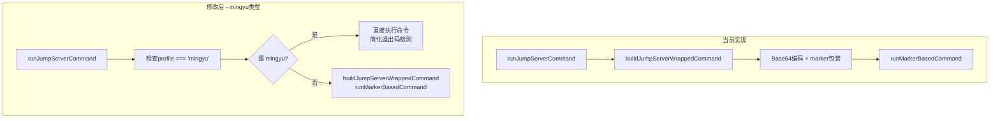

# 修改计划：Mingyu JumpServer AI Chat 命令执行方式

## 目标

将 mingyu 类型的 JumpServer AI Chat 命令执行方式改为类似普通 SSH 的直接执行方式，其他 JumpServer 类型保持不变。

## 实现状态

✅ **已完成实现**

### 修改的文件

1. **`src/main/agent/integrations/remote-terminal/jumpserverHandle.ts`**
   - 添加 `jumpserverConnections` 的导出，使 index.ts 可以访问

2. **`src/main/agent/integrations/remote-terminal/index.ts`**
   - 修改 `runJumpServerCommand` 方法，根据 `profile === 'mingyu'` 判断走哪个执行路径
   - 新增 `runMingyuDirectCommand` 方法：简化命令执行（无 Base64 包装）
   - 原有的 marker 追踪逻辑抽取为 `runJumpServerMarkerCommand` 方法

### 测试结果

- JumpServer 测试：72 passed ✅
- Remote-terminal 测试：26 passed ✅

## 问题分析

**当前行为**：
- 所有 JumpServer 类型（包括 mingyu）都使用 `buildJumpServerWrappedCommand` 包装命令（Base64编码 + marker追踪）
- 通过 `runMarkerBasedCommand` 执行命令

**预期行为**：
- 对于 mingyu 类型，用户已经手动完成菜单导航和密码输入，shell 已直接连接到目标机器
- AI Chat 执行命令时应像普通 SSH 一样直接写入命令，不使用 Base64 包装和 marker 追踪

## 修改方案



## 修改文件

### 1. `src/main/agent/integrations/remote-terminal/index.ts`

在 `runJumpServerCommand` 方法中：

```typescript
private async runJumpServerCommand(sessionId: string, command: string, cwd?: string): Promise<void> {
  const stream = jumpserverShellStreams.get(sessionId)
  if (!stream) {
    throw new Error('JumpServer connection not found')
  }

  // 检查是否是 mingyu 类型 - 使用简化执行方式
  const connectionData = jumpserverConnections.get(sessionId)
  const isMingyu = connectionData?.navigationPath?.profile === 'mingyu'

  if (isMingyu) {
    // Mingyu 类型：使用类似普通 SSH 的直接执行方式
    await this.runMingyuDirectCommand(sessionId, command, cwd)
  } else {
    // 其他 JumpServer：使用 marker 追踪执行
    await this.runJumpServerMarkerCommand(sessionId, command, cwd)
  }
}

// 新增：Mingyu 直接命令执行（类似普通 SSH）
private async runMingyuDirectCommand(sessionId: string, command: string, cwd?: string): Promise<void> {
  const stream = jumpserverShellStreams.get(sessionId)
  const logPrefix = `Mingyu ${sessionId}`

  // 构建简单命令（不需要 Base64 包装）
  const cleanCwd = cleanWorkingDirectory(cwd, logPrefix)
  const commandToExecute = cleanCwd
    ? `cd "${cleanCwd}" && ${command}`
    : command

  // 退出码标记
  const exitMarker = `===EXIT_${Date.now()}===`
  const wrappedCommand = `${commandToExecute}\necho ${exitMarker}$?\n`

  let lineBuffer = ''
  let exitCode: number | null = null

  const cleanup = () => {
    stream?.removeListener('data', onData)
    stream?.removeListener('close', onClose)
  }

  const onData = (data: Buffer) => {
    const chunk = data.toString('utf8')
    this.fullOutput += chunk

    if (this.interactionDetector) {
      this.interactionDetector.onOutput(chunk)
    }

    if (!this.isListening) return

    // 检测退出码
    if (!exitCode && chunk.includes(exitMarker)) {
      const match = chunk.match(new RegExp(`${exitMarker}(\\d+)`))
      if (match) {
        exitCode = parseInt(match[1], 10)
        cleanup()
        this.emit('exitCode', exitCode)
        this.emit('completed')
        this.emit('continue')
        return
      }
    }

    // 处理行输出
    let dataStr = lineBuffer + chunk
    const lines = dataStr.split(/\r?\n/)

    if (lines.length === 1) {
      lineBuffer = dataStr
    } else {
      lineBuffer = lines.pop() || ''
      for (const line of lines) {
        this.emit('line', line)
      }
    }
  }

  const onClose = () => {
    cleanup()
    if (lineBuffer) {
      this.emit('line', lineBuffer)
    }
    if (exitCode === null) {
      exitCode = 0 // 假设正常关闭
      this.emit('exitCode', exitCode)
    }
    this.emit('completed')
    this.emit('continue')
  }

  stream.on('data', onData)
  stream.on('close', onClose)

  // 写入命令
  stream.write(wrappedCommand)

  // 设置超时
  setTimeout(() => {
    if (exitCode === null) {
      cleanup()
      const error = new Error('Command execution timeout')
      this.emit('error', error)
      this.emit('completed')
      this.emit('continue')
    }
  }, this.JUMPSERVER_COMMAND_TIMEOUT)
}

// 重命名：原有的 marker 命令执行
private async runJumpServerMarkerCommand(sessionId: string, command: string, cwd?: string): Promise<void> {
  // 原 runJumpServerCommand 的实现
  const stream = jumpserverShellStreams.get(sessionId)
  // ... 原有逻辑保持不变
}
```

### 2. 需要导入 jumpserverConnections

在文件顶部添加导入：

```typescript
import {
  jumpserverConnections,
  jumpserverShellStreams,
  // ... 其他
} from './jumpserverHandle'
```

## 关键差异对比

| 特性 | 普通 JumpServer | Mingyu (修改后) |
|------|----------------|-----------------|
| 命令包装 | Base64 + marker | 直接写入 |
| 退出码检测 | marker 追踪 | 简单字符串匹配 |
| 执行延迟 | 较长（marker 解析） | 更短 |
| 命令可读性 | 隐藏（Base64） | 直接显示 |

## 验证步骤

1. [ ] 连接 mingyu 类型 JumpServer
2. [ ] 手动完成菜单导航和密码输入
3. [ ] 发起 AI Chat 对话
4. [ ] 执行命令，验证：
   - 命令输出正确
   - 退出码正确传递
   - 命令格式与普通 SSH 一致
5. [ ] 其他 JumpServer 类型不受影响
