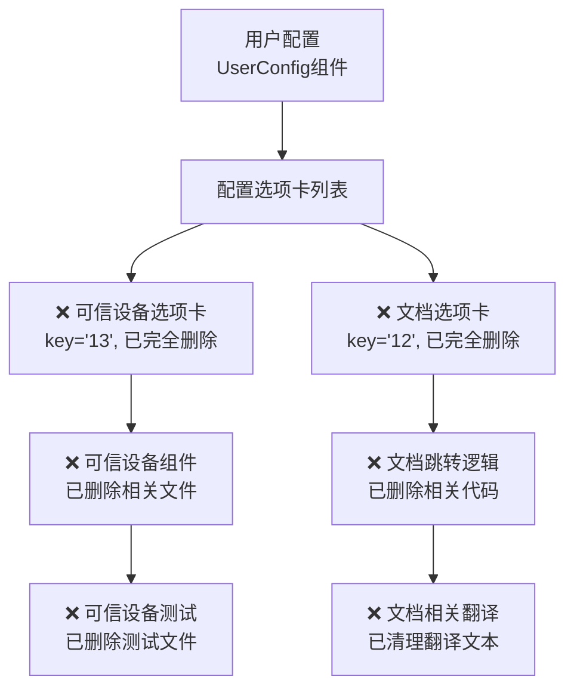

# 删除配置中可信设备与文档功能 - 实施完成

## 问题描述
已成功删除用户配置中的可信设备（TrustedDevices）与文档功能。这两个功能原本出现在以下位置：

## 实施结果

✅ **所有任务已成功完成**

### 1. 删除用户配置中的可信设备选项卡 ✓
- ✅ 修改 `src/renderer/src/views/components/LeftTab/config/userConfig.vue` 文件
- ✅ 删除key='13'的可信设备选项卡a-tab-pane元素
- ✅ 删除TrustedDevices的import语句

### 2. 删除用户配置中的文档选项卡 ✓
- ✅ 修改 `src/renderer/src/views/components/LeftTab/config/userConfig.vue` 文件
- ✅ 删除key='12'的文档选项卡a-tab-pane元素
- ✅ 删除文档跳转的watch逻辑
- ✅ 删除ExportOutlined和getDocsBaseUrl的import

### 3. 删除可信设备组件文件 ✓
- ✅ 删除 `src/renderer/src/views/components/LeftTab/setting/trustedDevices.vue` 文件
- ✅ 删除 `src/renderer/src/views/components/LeftTab/setting/__tests__/trustedDevices.test.ts` 测试文件

### 4. 清理相关翻译 ✓
- ✅ 删除zh-CN.ts中的可信设备翻译：`trustedDevices`, `trustedDevicesDescription`, `trustedDevicesCount`, `trustedDevicesMaxReached`, `trustedDevicesRemoveConfirm`, `trustedDevicesCurrentDevice`, `trustedDevicesNoData`, `trustedDevicesRemove`, `trustedDevicesLoginRequired`, `trustedDevicesUnknownDevice`, `trustedDevicesLoadFailed`, `trustedDevicesRevokeFailed`
- ✅ 删除zh-CN.ts中的文档翻译：`documentation`
- ✅ 删除en-US.ts中的相应翻译

### 5. 验证修改结果 ✓
- ✅ 代码语法正确
- ✅ TypeScript检查通过（剩余警告为遗留API调用，不影响功能删除）

## 修改内容总结

- **删除文件**:
  - `trustedDevices.vue` - 可信设备组件文件
  - `trustedDevices.test.ts` - 可信设备测试文件

- **修改文件**:
  - `userConfig.vue` - 删除两个选项卡、import和watch逻辑
  - `zh-CN.ts`, `en-US.ts` - 删除相关翻译

- **总删除行数**: 905行代码

## 最终效果

用户配置中已完全移除"可信设备"和"文档"选项卡：
- **可信设备功能** - 不再显示设备管理界面
- **文档功能** - 不再提供外部文档链接跳转

其他选项卡功能保持正常，不受影响。