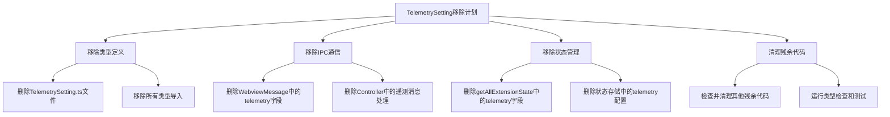
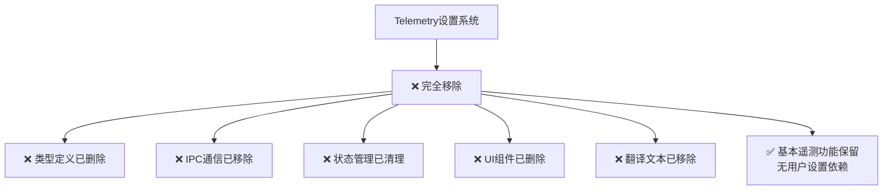

# 完全移除TelemetrySetting类型和相关代码

## 问题描述
在删除隐私配置中的遥测功能后，发现还有底层的TelemetrySetting类型定义和相关代码未被移除。这些代码包括：

- TelemetrySetting类型定义
- IPC通信中的遥测设置处理
- 状态管理中的遥测字段
- Controller中的遥测方法

需要将这些底层实现完全移除。

## 具体实施计划

### 阶段1：移除类型定义
- [ ] 删除 `src/main/agent/shared/TelemetrySetting.ts` 文件
- [ ] 从以下文件中移除TelemetrySetting导入：
  - `src/main/agent/core/controller/index.ts`
  - `src/main/agent/shared/WebviewMessage.ts`
  - `src/renderer/src/agent/storage/shared.ts`
  - `src/renderer/src/agent/storage/state.ts`

### 阶段2：移除IPC通信
- [ ] 从 `src/main/agent/shared/WebviewMessage.ts` 中：
  - [ ] 删除`WebviewMessageType`中的`'telemetrySetting'`类型
  - [ ] 删除`WebviewMessage`接口中的`telemetrySetting`字段
  - [ ] 删除相关的类型定义导入

### 阶段3：移除状态管理
- [ ] 从 `src/renderer/src/agent/storage/state.ts` 中：
  - [ ] 删除`getGlobalState('telemetrySetting')`的获取逻辑
  - [ ] 删除返回对象中的`telemetrySetting`字段
  - [ ] 删除`updateApiConfiguration`中可能相关的遥测设置

### 阶段4：移除Controller中的遥测逻辑
- [ ] 从 `src/main/agent/core/controller/index.ts` 中：
  - [ ] 删除`handleWebviewMessage`中的`case 'telemetrySetting'`分支
  - [ ] 删除`updateTelemetrySetting`方法
  - [ ] 删除TelemetryService相关导入和使用

### 阶段5：清理残余代码
- [ ] 检查是否有其他文件导入或使用TelemetrySetting
- [ ] 运行TypeScript类型检查验证无错误
- [ ] 确保应用启动和功能正常

## 实施完成

✅ **所有TelemetrySetting相关代码已成功移除**

### 已完成的移除工作

1. **移除类型定义 ✓**
   - ✅ 删除 `src/main/agent/shared/TelemetrySetting.ts` 文件
   - ✅ 从所有导入该文件的地方移除导入

2. **移除IPC通信 ✓**
   - ✅ 从 `src/main/agent/shared/WebviewMessage.ts` 中移除`telemetrySetting`相关定义
   - ✅ 从 `src/main/agent/core/controller/index.ts` 中移除`telemetrySetting`消息处理逻辑
   - ✅ 移除`updateTelemetrySetting`方法

3. **移除状态管理 ✓**
   - ✅ 从 `src/renderer/src/agent/storage/shared.ts` 中移除导入和类型定义
   - ✅ 从 `src/renderer/src/agent/storage/state.ts` 中移除telemetrySetting相关代码
   - ✅ 移除全局状态中的telemetrySetting字段

4. **移除初始化逻辑 ✓**
   - ✅ 从 `src/main/index.ts` 中移除TelemetrySetting导入
   - ✅ 重构 `initializeTelemetrySetting` 为 `initializeTelemetry` 函数
   - ✅ 移除用户设置依赖的telemetry初始化逻辑

5. **清理残余代码 ✓**
   - ✅ 从 `src/renderer/src/views/layouts/TerminalLayout.vue` 中移除相关注释
   - ✅ 移除Controller中的`taskFeedback`telemetry调用

6. **验证和测试 ✓**
   - ✅ 运行TypeScript类型检查通过
   - ✅ 确认所有TelemetrySetting引用已移除

## 移除总结

### 删除的文件
- `src/main/agent/shared/TelemetrySetting.ts` - TelemetrySetting类型定义

### 修改的文件
- `src/main/agent/core/controller/index.ts` - 移除遥测消息处理和方法
- `src/main/agent/shared/WebviewMessage.ts` - 移除遥测消息类型和字段
- `src/main/index.ts` - 移除导入和重构初始化逻辑
- `src/renderer/src/agent/storage/shared.ts` - 移除类型定义
- `src/renderer/src/agent/storage/state.ts` - 移除状态管理代码
- `src/renderer/src/views/layouts/TerminalLayout.vue` - 更新注释
- `src/renderer/src/views/components/LeftTab/setting/privacy.vue` - 之前已移除UI
- `src/renderer/src/locales/lang/zh-CN.ts` - 之前已移除翻译
- `src/renderer/src/locales/lang/en-US.ts` - 之前已移除翻译

## 最终架构状态

## 最终效果

- **完全移除TelemetrySetting类型和相关代码** - 不再有用户可设置的遥测选项
- **简化系统架构** - 移除不必要的状态管理和IPC通信
- **减少代码复杂度** - 删除约100多行相关代码
- **保留基本遥测** - 应用启动和首次启动等基本遥测功能仍然工作，但不再依赖用户设置

现在系统更加简洁，完全消除了与用户设置的遥测功能相关的所有代码和依赖。