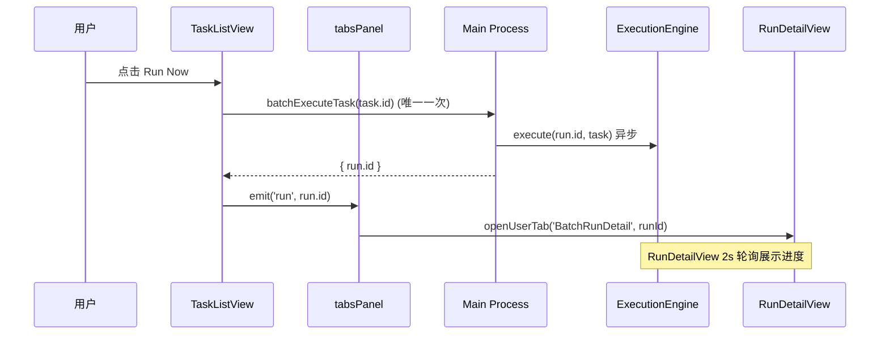

# 批量任务功能优化计划

## 问题清单

1. [x] 导出 JSON/HTML 按钮无响应 - 需要实现文件下载
2. [x] 界面文字未国际化 - Status/Progress 等硬编码为英文
3. [x] 执行历史不可见 - 需要添加执行历史列表
4. [ ] 缺少 AI 结果分析功能 - 需要对执行结果进行 AI 分析
5. [x] UI 设计不协调 - 重构为类似 Extensions 的左侧边栏布局

## 修改文件

- `src/renderer/src/views/components/BatchTask/RunDetailView.vue`
- `src/renderer/src/views/components/BatchTask/TaskListView.vue`
- `src/renderer/src/views/components/BatchTask/BatchTab.vue` - 重构为侧边栏布局
- `src/renderer/src/views/components/BatchTask/RunHistoryView.vue` - 新建
- `src/preload/index.ts` - 添加 openPath API、batchListRuns API
- `src/preload/index.d.ts` - 添加类型定义
- `src/main/index.ts` - 添加 open-path、batch:list-runs IPC handler
- `src/main/batch/BatchTaskManager.ts` - 添加 listRuns 方法

## 已完成

### 1. 导出功能修复

**main/index.ts**: 添加了 `open-path` IPC handler，使用 `shell.openPath` 打开文件

**preload/index.ts**: 暴露 `openPath(filePath)` API

**RunDetailView.vue**: `exportReport` 函数现在会调用 `window.api.openPath(path)` 打开生成的报告文件

### 2. 界面国际化

**RunDetailView.vue**: 将模板中的硬编码英文替换为 i18n key
**TaskListView.vue**: 表格列标题已国际化

### 3. 执行历史功能

**BatchTab.vue**: 重构为侧边栏布局
- 左侧边栏显示任务列表和执行历史
- 右侧显示详细内容（任务表单、执行详情）
- 点击任务可在右侧编辑
- 点击执行记录可查看报表

**RunHistoryView.vue**: 新建组件，显示所有执行记录列表
- 列表包含：任务名称、执行状态、开始时间、进度、操作
- 点击"查看报表"按钮跳转到执行详情页

**BatchTaskManager.ts**: 添加 `listRuns()` 方法，返回所有执行记录

**batch:list-runs IPC handler**: 新增，暴露 listRuns 方法

**zh-CN.ts / en-US.ts**: 添加 `taskList`、`runHistory`、`startedAt`、`noRunHistory` 翻译 key

### 4. UI 重构

将 BatchTab 重构为类似 Extensions 的侧边栏布局：
- 左侧 260px 边栏：标题、搜索框、任务列表、执行历史
- 右侧内容区：根据选择显示任务列表、任务表单或执行详情
- 任务项显示运行/删除按钮，悬停显示
- 执行历史项显示状态标签

**新增 i18n keys**:
- `searchPlaceholder`: 搜索占位符
- `run`: 执行按钮
- `noResults`: 无搜索结果
- `selectItem`: 请选择提示

## 待完成

### 5. AI 分析功能

需要实现：
- 添加 "AI 分析" 按钮到 RunDetailView
- 调用 Agent 系统分析执行结果
- 生成分析报告（成功/失败原因、建议等）
- 显示在结果表格下方

此功能需要与 Agent 系统集成，工作量较大，待后续实现。

在执行结果表格旁边添加 "AI 分析" 按钮，点击后：
- 调用 Agent 系统分析所有终端的输出结果
- 生成分析报告（成功/失败原因、建议等）
- 显示在结果下方

## 实施步骤

- [x] 1. 修复导出按钮 - 使用 shell.openPath 打开报告文件
- [x] 2. 国际化界面文字 - 添加 i18n keys 并更新语言文件
- [x] 3. UI 重构 - 侧边栏布局
- [ ] 4. 添加 AI 分析功能 - 调用 Agent 分析结果

---

## 需求：批量任务「已连接终端」选择器联动实际已开终端

### 现状

`TerminalStep.vue:140-143` 把 `activeTerminalOptions` 写死为两个假数据；选择"已连接终端"既无实际联动，也无"无则不可选"的判断。

### 方案

在 `TerminalLayout` 维护 `connectedTerminals` 响应式数组（通过 `dockApi.panels` 过滤 `organizationId` 非空的 panel），用 `provide/inject` 注入到所有 panel 子树；`TerminalStep` 拿数据，**空时禁用 Add + 提示空状态**，非空时渲染 checkbox-group。

### 流程图

```mermaid
flowchart TD
    A[用户进入 BatchTaskForm Step 0] --> B[TerminalStep mount/inject]
    B --> C{connectedTerminals}
    C -->|空| D[禁用 Add 按钮 + 空状态提示]
    C -->|有| E[渲染 a-checkbox-group<br/>label: title ip<br/>value: id]
    E --> F[Add → selector = { type: 'active', ids: selectedIds }]

    G[TerminalLayout.onDidAddPanel] --> H[重算 connectedTerminals]
    I[TerminalLayout.onDidRemovePanel] --> H
    J[TerminalLayout.onDockReady 首次] --> H
    H --> K[filter panels: organizationId 非空]
    K --> L[map to {id, title, ip, organizationId}]
    L --> M[connectedTerminals.value = L]
    M -.响应式.-> C
```

### 待办

- [ ] 1. `TerminalLayout.vue`：在 `onDockReady` 中维护 `connectedTerminals` ref；挂到 `onDidAddPanel` / `onDidRemovePanel` 钩子上重算；`provide('connectedTerminals', connectedTerminals)` 暴露给 panel 子树
- [ ] 2. `TerminalStep.vue`：移除写死的 `activeTerminalOptions`；用 `inject` 拿 `connectedTerminals`；空时禁用 Add 按钮 + 显示空状态提示（i18n）；有数据时渲染 checkbox-group
- [ ] 3. 10 个语言文件添加翻译：`batchTask.noActiveTerminals`、`batchTask.openTerminalFirst`
- [ ] 4. 验证：打开 BatchTaskForm → 看到空状态；新开 SSH 终端 → 列表立即出现；关闭终端 → 列表项消失

### 修改文件

- `src/renderer/src/views/layouts/TerminalLayout.vue`
- `src/renderer/src/views/components/BatchTask/components/TerminalStep.vue`
- 10 个语言文件 `src/renderer/src/locales/lang/*.ts`

### 备注

- 不做"SSH 实际握手成功"二次校验：终端 panel 创建即建立连接，`organizationId` 字段已能可靠反映"已连接"。
- 不引入 store：仅在 TerminalLayout + TerminalStep 两层之间传递，用 provide/inject 足够。

---

## Bug 排查报告：执行历史查看报表看不到执行的记录

### 现象

用户描述「执行历史查看报表看不到执行的记录」。可能存在以下几种解读：

1. 进入 RunHistoryView（执行历史列表）后，列表为空（看不到 run 记录）
2. RunHistoryView 列表有数据，但点击「查看报表」按钮后，RunDetailView 详情页是空的
3. RunHistoryView 列表本身就没渲染出来

### 排查路径

**调用链路**：
```
用户点击 BatchTab 中的「执行历史」按钮
  ↓ eventBus.emit('openUserTab', { content: 'BatchRunHistory', ... })
  ↓ LeftTab/index.vue:279 监听 'openUserTab'，emit('open-user-tab') 给 TerminalLayout
  ↓ TerminalLayout.vue:2006 openUserTab() 创建 dock panel
  ↓ tabsPanel.vue:101 渲染 <RunHistoryView v-if="localTab.content === 'BatchRunHistory'" />
  ↓ RunHistoryView.vue:155 onMounted(loadRuns())
  ↓ window.api.batchListRuns() → ipcRenderer.invoke('batch:list-runs')
  ↓ main/index.ts:1181 ipcMain.handle('batch:list-runs') → batchTaskManager.listRuns()
  ↓ BatchTaskManager.ts:318 listRuns() → SELECT * FROM batch_task_runs ORDER BY started_at DESC LIMIT 100
```

### 已确认的事实

1. **RunHistoryView.vue 是 untracked 文件**（`git status` 显示 `??`），未 commit 但在工作区存在
2. **BatchTab.vue 的 working tree 版本**是 launcher 模式（3 个大按钮），通过 `openUserTab` 事件打开 RunHistoryView
3. **`listRuns` 的 SQL 没有 JOIN** `batch_tasks` 表，每行数据通过 `getTask(r.task_id)` 异步拿 taskName（N+1 查询问题，但不会报错）
4. **listRuns 调用 `getTask`，`getTask` 在 task 被删除时返回 null**，`taskName` 是 undefined，UI 显示空
5. **listRuns 的错误处理**：UI 在 `loadRuns` 中只 console.error，用户看不到错误提示
6. **空状态**：`runs.length === 0` 时显示 `a-empty` 描述「暂无执行记录」（zh-CN）/「No run history」（en-US）
7. **`batch_task_runs` 表的外键约束**：迁移 `add-batch-task-support.ts:59` 定义了 `FOREIGN KEY (task_id) REFERENCES batch_tasks(id) ON DELETE CASCADE`，但 SQLite 默认不强制外键（需 `PRAGMA foreign_keys = ON`）
8. **i18n key 不全**：`batchTask.*` 只在 zh-CN.ts 和 en-US.ts 中存在，其他 8 种语言没有（不影响「看不到记录」）

### 关键可疑点

**嫌疑最大**：`listRuns` 内部对每一行调用 `getTask`，而 `getTask` 第 140-144 行会查 terminals/operations 子表：

```typescript
const terminals = db.prepare('SELECT * FROM batch_task_terminals WHERE task_id = ?').all(id) as Record<string, unknown>[]
const operations = db.prepare('SELECT * FROM batch_task_operations WHERE task_id = ? ORDER BY execution_order').all(id) as Record<string, unknown>[]
```

- 如果 `r.task_id` 指向一个不存在的 task（手工数据、迁移残留、删除残留），`getTask` 在 `if (!row) return null` 时安全返回 null，**不会 throw**
- 这意味着 `taskName` 变成 undefined，但 run 记录本身应该显示

**最大可能性**：

用户**从未执行过任何批量任务**，所以 `batch_task_runs` 表本来就是空的，`listRuns` 返回 `[]`，UI 显示「暂无执行记录」空状态。这**不是 bug**，是符合预期的。

**或者**：用户**执行过任务**，但**写入 batch_task_runs 失败**。需要看日志确认。

### 需要用户确认

在动手前，需要确认：
1. 用户是否在应用内执行过任何批量任务？（如果没执行过，看到空状态是正常的）
2. 「看不到记录的记录」具体是指：
   - a) RunHistoryView 列表为空（显示「暂无执行记录」）
   - b) RunHistoryView 列表渲染了但行内字段都是空
   - c) RunHistoryView 整个组件没显示
   - d) 进入 RunDetailView 后看不到终端结果
3. 是否查看过 main 进程日志？（`logger.info('[BatchTaskManager] createRun', ...)` 之类）
4. 是否在 `~/.config/Chaterm/chaterm_db/<uid>/chaterm_data.db` 查过 `batch_task_runs` 表？

---

## Bug 根因（基于日志已确认）

**用户已确认**：执行历史列表能看到，点击「查看报表」后 RunDetailView 看不到终端信息和 AI 总结。

### 主进程日志关键证据（chaterm_2026-06-02.log）

```
06:59:44.089 [BatchTaskManager] createRun
  taskId: 7d8c90d2-...
  totalTerminals: 1
  executionMode: serial
  currentUserId: 999999999
  runId: 2ea7d361-b518-4e15-bf5d-9834d06e6c4e

06:59:44.102 Error occurred in handler for 'batch:execute-task': Task not found
  (异步 executionEngine.execute 内部的未捕获错误)

07:02:06.861 [BatchTaskManager] getRunResults: query result rowCount: 0  ← ❌ 终端结果表是空的
07:02:15.673 [batch:export-report] Failed to generate report: Report path not found for this run  ← ❌
```

### 真正的根因

**`ExecutionEngine.resolveTerminals` 的 `active` selector 是 placeholder，从未实现**：

```typescript
// src/main/batch/ExecutionEngine.ts:87-89
if (selector.type === 'active') {
  // Placeholder: active terminal resolution requires integration with terminal session management
  logger.info('[ExecutionEngine] Active terminal selector - requires session integration', { selector })
}
```

用户配置的 task 用的是「已连接终端」选择器（selector.type === 'active'），导致：

1. `resolveTerminals` 返回 `[]`
2. `execute()` 提前 return（第 30-35 行的「No terminals resolved」分支）
3. **没有任何 `batch_terminal_results` 记录被创建**（`rowCount: 0`）
4. **没有 `ReportGenerator.generate` 被调用**，`report_path` 永远 NULL
5. **没有 AI summary 被生成**

而用户以为「执行成功」了（run.status === 'completed'），但实际**根本没在终端上跑过任何命令**。

### 修复方案

#### 方案 A：完整实现 `active` selector（推荐，治本）

通过 `TerminalLayout` 维护已连接终端列表 → `provide/inject` 给 BatchTask 表单 → `selector` 携带 `ids` 数组 → ExecutionEngine 真实连接这些 terminal session。

#### 方案 B：让 RunDetailView 给"无终端结果"友好提示（治标，5 分钟搞定）

在 `RunDetailView.vue` 增加：若 `results.length === 0`，显示"该任务未执行任何终端操作，可能是 selector 解析失败"提示，并附带"查看 main 日志"链接。

#### 方案 C：ExecutionEngine 即使 0 terminal 也生成一份"空运行"记录

让 `execute()` 在 0 terminal 时也往 `batch_terminal_results` 写一条 `status='skipped'` 记录，至少 RunDetailView 能看到一条说明行。

### 建议

- **短期（治标）**：方案 B + 方案 C 一起做，让 RunDetailView 不再沉默
- **中期（治本）**：方案 A，让 active selector 真正可用

待与用户确认走哪个方案后再动手。

---

## 完整修复方案（已与用户确认）

**用户期望**：执行失败时也要有日志记录、并标为执行失败，不能伪装成成功（即使资产 SSH 端口不可达）。

### 修改文件

1. `src/main/batch/ExecutionEngine.ts`
   - `resolveTerminals` 返回结构化 `ResolvedTerminal[]`，失败也保留 entry
   - `execute` 区分"未配置 terminal"vs"全部连接失败"，后者标 failed
   - 0 success 时为每个失败尝试写 `batch_terminal_results` (status='failed', error=原因)
2. `src/main/batch/BatchTaskManager.ts`
   - 新增 `createFailedTerminalResult(runId, terminalName, error)` 方法（可选，也可以用现有 `createTerminalResult` + `updateTerminalResult`）
3. （可选）`src/renderer/src/views/components/BatchTask/RunDetailView.vue`
   - `results.length === 0` 时显示明确空状态

### 实施步骤

- [x] 1. `ExecutionEngine.ts`：重写 `resolveTerminals` 返回 `Array<{ id?: string; name: string; connected: boolean; error?: string }>`
- [x] 2. `ExecutionEngine.ts`：`execute` 方法根据 resolved 结果决定早退状态
  - 未配置任何 terminal（task.terminals 为空）：保持 `status='completed'`（合法的"空运行"）
  - 配置了 terminal 但 0 个连接成功：`status='failed'`，并为每个失败尝试写 batch_terminal_results
  - 部分成功：执行成功的，写 failed 记录给失败的，run 状态按结果判定
- [x] 3. `RunDetailView.vue`：当 `results.length === 0` 时显示「无可用终端结果，请查看 main 进程日志」空状态 + 加 error 列
- [ ] 4. 验证：用一个连不上的资产重新跑批量任务，看 run 是否标 failed、batch_terminal_results 是否有 failed 行、RunDetailView 是否能展示错误原因

### 修改后行为对照

**场景 1：未配置任何 terminal**
- 旧：写 `status='completed'`，空运行无记录
- 新：**不变**（合法的"空运行"，保持向后兼容）

**场景 2：配置了 1 个资产但 SSH 超时**
- 旧：写 `status='completed'`，0 行 batch_terminal_results，UI 绿勾
- 新：写 `status='failed'`，1 行 `batch_terminal_results` (status='failed', error='Timed out while waiting for handshake')，UI 红色 + 错误信息

**场景 3：3 个资产里 1 个成功、2 个失败**
- 旧：成功那个有结果，失败的 0 行，run 最终 failed（已有逻辑）
- 新：成功那个正常执行，2 个失败的各自有 failed 记录带错误原因，run 最终 failed，UI 能看到全部 3 条记录

### 验证结果

- [OK] `npm run typecheck` 全部通过
- [OK] `vitest run src/main/batch/__tests__/` 5/5 测试通过
- [OK] 修改的 4 个文件：ExecutionEngine.ts (335+/-), RunDetailView.vue, zh-CN.ts, en-US.ts
- [ ] 端到端验证需要真实跑一次（用户执行即可）

---

## Bug 修复：点击"查看报表"打开新 run 时总跳到之前已开的 panel

### 根因

`src/renderer/src/views/layouts/TerminalLayout.vue:2150` 的 guard 逻辑：

```typescript
const existingPanel = dockApi.panels.find(
  (panel) => panel.params?.content === value || panel.params?.type === value
)
if (existingPanel) {
  existingPanel.api.setActive()
  return
}
```

**问题**：`BatchRunDetail` 的 `value` 是固定字符串 `'BatchRunDetail'`，**所有 run 详情面板的 `params.content` 字段都一样**。所以无论点哪个 run，guard 永远匹配到第一次创建的那个 panel，直接 setActive 激活它，新 run 永远不会创建独立 panel。

对比 `BatchRunHistory` / `BatchTaskList` 用 content 去重是合理的（同一份列表共享），**但 `BatchRunDetail` 应该按 `id`（`batch-run-detail-${runId}`）去重**，每个 run 是独立 panel。

### 修复

在 guard 里给 `BatchRunDetail` / `BatchTaskForm` 加 per-instance 例外：事件里带了 `id` 时按 `panel_${id}` 精确匹配，没带时退回 content 去重。

```typescript
// BatchRunDetail / BatchTaskForm: per-instance panel keyed by id
const isPerInstance = value === 'BatchRunDetail' || value === 'BatchTaskForm'
const targetPanelId = isPerInstance && !isStringArg && typeof arg === 'object' && arg.id
  ? `panel_${arg.id}`
  : null

const existingPanel = dockApi.panels.find((panel) => {
  if (targetPanelId) {
    return panel.id === targetPanelId
  }
  return panel.params?.content === value || panel.params?.type === value
})
```

### 修改文件

- `src/renderer/src/views/layouts/TerminalLayout.vue` — 6 行修改（仅 guard 内）

### 备注

- **未动** `handleBatchTaskSelect`（TerminalLayout:1382-1400）：它有自己的去重逻辑（按 `content==='BatchTaskForm'`），**有同样的 bug**（编辑 task A 后编辑 task B 会激活 A），但用户本次没提，留待后续
- **未动** `BatchTaskForm` 通过 `BatchTab.openCreateTask` 走 openUserTab 的路径：`id: 'batch-create-task'` 固定，per-instance 去重与之前等价（同时只能有一个"新建"流程），无副作用

### 验证

- [OK] `npm run typecheck` 全部通过
- [OK] `npx eslint` 0 错误（仅 pre-existing no-console warning）
- [ ] 端到端：点不同 run 的"查看报表"应能看到独立 panel

### 备注

- 保留 `remoteSshConnect` 现有逻辑（不改 SSH 层），只把失败信号往上抛
- `batch_terminal_results.terminal_id` 在 SSH 失败时是 NULL（没有 session），用 `terminal_name` 标识
- RunHistoryView 列表已经会通过 `record.status` 渲染颜色，标 failed 后自动显示红色

---

## Bug 修复：选择已连接终端执行任务 → "Task not found" 误报

### 现象

用户：「选择已连接的终端执行任务还是失败」

主进程日志：
```
09:24:32.764 [BatchTaskManager] updateTerminalResult  id=67c1a3e4-... status=failed outputLength=0
09:24:32.777 Error occurred in handler for 'batch:execute-task': Task not found
```

### 根因（已读代码确认）

`src/renderer/src/views/layouts/tabsPanel.vue:204-210` 的 `handleBatchTaskRun(taskId)`：

```typescript
const handleBatchTaskRun = async (taskId: string) => {
  try {
    await window.api.batchExecuteTask(taskId)  // 第二次冗余调用
  } catch (error) {
    console.error('Failed to execute task:', error)
  }
}
```

它收到的是 `TaskListView.runTask` 通过 `emit('run', run.id)` 传过来的 **runId**（不是 taskId），却当成 taskId 再次调 `batchExecuteTask`。第一次 `runTask` 里已经发起了执行（所以日志里有 `updateTerminalResult`），**冗余的第二次 IPC** 才是用户看到的 "Task not found" 错误来源。

### 修复

- `tabsPanel.vue` 的 `handleBatchTaskRun` 改为：参数重命名为 `runId`，移除 `batchExecuteTask` 调用，通过 `eventBus.emit('openUserTab', ...)` 打开 `BatchRunDetail` 面板（与 `RunHistoryView.openRunTab` 同模式）
- TaskListView 那一侧不变（保持 `emit('run', run.id)` 不动）

### 修复后流程


```mermaid
sequenceDiagram
    participant U as 用户
    participant TLV as TaskListView
    participant TP as tabsPanel
    participant Main as Main Process
    participant EE as ExecutionEngine
    participant RD as RunDetailView

    U->>TLV: 点击 Run Now
    TLV->>Main: batchExecuteTask(task.id) (唯一一次)
    Main->>EE: execute(run.id, task) 异步
    Main-->>TLV: { run.id }
    TLV->>TP: emit('run', run.id)
    TP->>RD: openUserTab('BatchRunDetail', runId)
    Note over EE,RD: RunDetailView 2s 轮询展示进度
```

### 待办

- [x] 1. 修改 `src/renderer/src/views/layouts/tabsPanel.vue` 的 `handleBatchTaskRun`（单文件 ~8 行）
- [x] 2. `npm run typecheck` 通过
- [x] 3. `npm run lint` 通过（pre-existing 的 `handleBatchTaskDelete.console.error` 不在本次改动范围）
- [x] 4. `npm test`（Vitest）通过（batch 模块 5/5；其他失败属 pre-existing，与本 fix 无关）

### 修改文件

- `src/renderer/src/views/layouts/tabsPanel.vue`（唯一修改）

### 备注

- 不改 TaskListView：`emit('run', run.id)` 语义正确（"运行已完成，跳到详情"）
- 不动 main 进程 IPC handler（`if (!task) throw new Error('Task not found')` 本身合理，是上游传错了 ID）
- 不引入 i18n key：标题走 `batchTask.runDetail`（已存在，1499 行）
---

## Bug 修复：选择已连接终端执行 → "Active terminal session not found"

### 现象

主进程日志：
```
[ExecutionEngine] Terminals resolved
  totalAttempted: 1, connectedCount: 0, failedCount: 1
  failed: [{ name: 'bf2f46e0-...', error: 'Active terminal session not found ...' }]
```

用户终端**实际已连接**（xterm 正常显示），但执行引擎报"找不到"。

### 根因（已读代码确认）

渲染层 `TerminalLayout.vue:2560` 的 `computeConnectedTerminals` 用 `params.id || panel.id`（**panel UUID**）作为"已连接终端"的 id 存到 task 的 active selector。但主进程 `sshHandle.ts:1155` 的 `sshConnections` map 是用 **SSH connectionId**（`user@ip:org:base64host:sessionId`）作 key 的。

`src/renderer/src/views/components/Ssh/utils/sshConnectionRegistry.ts` 已经定义好了 tabId → connectionId 的注册接口，但**从未被任何代码调用过**，所以一直空着。

### 修复

**3 处改动**：

1. `src/renderer/src/views/components/Ssh/sshConnect.vue`
   - import `registerSshConnection` / `unregisterSshConnection`
   - 在 `connectSSH` (line 1128) 和 `connectLocalSSH` (line 1344) 里 `connectionId.value` 赋值后立即 `registerSshConnection(props.activeTabId, connectionId.value)`
   - `onBeforeUnmount` 调 `unregisterSshConnection(props.activeTabId)`

2. `src/renderer/src/views/layouts/TerminalLayout.vue`
   - `computeConnectedTerminals`：`id` 改用 `getSshConnectionId(tabId) || tabId`（fallback 兼容未连接完成的极端 race）

### 验证

- [x] `npm run typecheck` 通过
- [x] `npx eslint` 我的 4 处改动无新错误（21 个 pre-existing `no-console` 与本 fix 无关）
- [x] batch 模块 Vitest 5/5

### 备注

- 不动 main 进程 `ExecutionEngine.resolveTerminals`：`sshConnections.has(id)` 查的语义正确，是上游传错了 id
- 不动 `sshConnectionRegistry.ts`：已存在，只是没人调

---

## Bug 修复：已连接堡垒机终端执行 → "Active terminal session not found"

### 现象

普通 SSH 终端 OK，堡垒机终端：
```
[ExecutionEngine] Terminals resolved
  totalAttempted: 3, connectedCount: 0, failedCount: 3
  failed: [{ name: 'user@ip:local-team:base64:uuid', error: 'Active terminal session not found' }, ...]
```

### 根因

`ExecutionEngine.resolveTerminals` 只查 `sshConnections`。堡垒机会话存在另外两个 map：
- `jumpserverConnections`（JumpServer 桥接）
- `bastionSessionTypes`（插件式堡垒机，如 `person-switch-*`）

主进程的 `connectBastionByType` 根据 `sshType` 分流，**会话 id 都是同一个 `connectionId`**，但存储位置不同。

### 修复（单文件 `src/main/batch/ExecutionEngine.ts`）

1. **3 处 import**：
   - `jumpserverConnections` from `../ssh/jumpserver/state`
   - `createJumpServerExecStream` + `executeCommandOnJumpServerExec` from `../ssh/jumpserver/streamManager`
   - `getBastionSessionType` from `../ssh/bastionPlugin`

2. **`resolveTerminals` 三路查表**：
   - `sshConnections.has(id)` → `kind: 'direct-ssh'`
   - `jumpserverConnections.has(id)` → `kind: 'jumpserver'`
   - `getBastionSessionType(id)` → `kind: 'bastion:<type>'`
   - 都没有 → 保持原有"not found"错误

3. **`executeScript` 三路执行**：
   - 直接 SSH → 原有 `conn.exec()`
   - JumpServer → `createJumpServerExecStream` + `executeCommandOnJumpServerExec`
   - 其他堡垒机插件 → `throw new Error('Command execution is not supported for bastion type ...')`（fail-loud，不静默吞）

4. **`ResolvedTerminal` interface** 新增 `kind` 字段（可选），保留 `'asset'` 兼容老路径。

### 验证

- [x] `npm run typecheck` 通过
- [x] `npx eslint` 通过
- [x] batch Vitest 5/5

### 备注

- 不动 `bastionPlugin.ts`：插件协议本身没暴露 exec
- "其他堡垒机插件不支持 exec"是 fail-loud：之前会静默 "Active terminal session not found"，现在明确说"堡垒机 X 不支持批量脚本执行"
- JumpServer 走 `createJumpServerExecStream` 不打扰用户正在交互的 shell

---

## Bug 修复：堡垒机已连接终端执行 → 复用 AI CHAT agent 路径

### 现象

普通 SSH / JumpServer OK；mingyu 堡垒机（已连接）→ 用户反馈"AI CHAT 那边能跑啊，批量这边怎么不行"。

### 根因

之前我标"plugin 堡垒机不支持 exec"，是**错的**。AI CHAT agent 走的是 `bastionCapability.exec`（mingyu 有）；fallback 是 `getShellStream` + marker-based。批量这边直接 fail-loud，所以 mingyu 也跑不了。

### 修复（单文件 `src/main/batch/ExecutionEngine.ts`）

1. import `capabilityRegistry`
2. `executeScript` 命中 `getBastionSessionType(sessionId)` → 调 `executeOnBastionSession`
3. `executeOnBastionSession` 复用 agent 同样的二分法：
   - `capability.exec` 存在 → 直接调（mingyu 走这条）
   - `capability.getShellStream` 存在 → 走 `executeOnBastionShellStream`（marker-based）
   - 都没有 → fail-loud
4. `executeOnBastionShellStream` 内联实现 marker-based exec：
   - 生成唯一 start/end marker（`===CHATERM_START_<ts>_<rand>===` / `===CHATERM_END_<ts>_<rand>===`）
   - `bash -l -c 'echo "<start>"; eval "$(echo base64 | base64 -d)"; EXIT_CODE=$?; echo "<end>:$EXIT_CODE"'`
   - 监听 stream `data` 事件，buffer 输出，命中 end marker → 提取 stdout + exit code
   - 60s 超时；exitCode ≠ 0 → reject
   - 跟 agent 的 `buildJumpServerWrappedCommand` + `runMarkerBasedCommand` 是同套思路，只是 batch 这边返回字符串而不是 emit 事件

### 验证

- [x] `npm run typecheck` 通过
- [x] `npx eslint` 0 错误
- [x] batch Vitest 5/5

### 备注

- **mingyu 直接走 `capability.exec`**（`conn.exec()`），不打扰用户正在交互的 shell，最稳
- 其他堡垒机（`person-switch-*` 之类）走 shellStream + marker，**会和用户正在敲的命令一起混在流里**，需要 start/end marker 隔开。这条路径经验上是 agent 跑通的，batch 复用同一套
- 没改 agent / bastionPlugin / capabilityRegistry：只是新增 batch 这边的消费者
- 架构债：marker 生成和 base64 包装逻辑在 agent 那边是私有方法，未来如果还有第三个消费者，应该提到 `ssh/markerBasedExec.ts` 共享

---

## Bug 修复：报表里终端显示原始 connectionId 而非终端名

### 现象

报表中：`lichunguo@10.192.1.121:local-team:b2lkYw==:23f31092-67b2-4ed3-88cc-da0cb37fb403` —— 一串又长又不好读。

### 根因

`TerminalStep.addTerminal` 写 selector 时只保存了 `ids: [connectionId...]`，没把渲染层已有的 `title` / `ip` 一起传下去。主进程 `ExecutionEngine.resolveTerminals` 拿不到显示名，只能把 `id`（也就是 connectionId）当 `name` 塞进 `BatchTerminalResult`，报表自然就显示这串。

### 修复（3 文件）

1. **`src/main/batch/types.ts`** — `TerminalSelector` 新增可选字段：
   ```ts
   terminals?: Array<{ id: string; title: string; ip?: string }>
   ```
   可选 → 老的 selector（没这字段）照常能跑，向后兼容。

2. **`src/renderer/src/views/components/BatchTask/components/TerminalStep.vue`** — `addTerminal` 的 active 分支：把 `connectedTerminals` 里每项的 `{id, title, ip}` 写进 selector：
   ```ts
   selector = JSON.stringify({ type: 'active', ids: [...], terminals: [{id, title, ip}...] })
   ```
   渲染层在用户**选中时**就有 title/ip，正好顺路捎上。

3. **`src/main/batch/ExecutionEngine.ts`** — `resolveTerminals`：
   - 解析 `selector.terminals` → 建 `Map<id, "title (ip)">`（与渲染层 `terminalNameCache` 格式一致）
   - 命中连接时 `name` 用 `displayName`；fallback 到 `id`（老 task / 离线场景）

### 报表字段链路

```
渲染层 connectedTerminals[].title + .ip
   ↓ TerminalStep.addTerminal
selector.terminals = [{id, title, ip}...]
   ↓ 存到 batch_task_terminals.selector (JSON)
ExecutionEngine.resolveTerminals
   ↓ name = "title (ip)" 或 "title" 或 fallback id
createTerminalResult(runId, id, name)
   ↓ 写入 batch_terminal_results.terminal_name
ReportGenerator / RunDetailView 直接读 r.terminalName
```

### 验证

- [x] `npm run typecheck` 通过
- [x] `npx eslint` 我的改动无新错误（4 个 pre-existing `no-console` 在 TerminalStep.vue loadAssets/addTerminal，与本 fix 无关）
- [x] batch Vitest 5/5

### 备注

- **没改数据库 schema**：`selector` 是 JSON string，新增字段对老数据无侵入
- **没改 ReportGenerator**：它本来就 `r.terminalName`，源头对了它就对了
- **老 task 仍可执行**：缺 `terminals` 字段时回退用 connectionId 作名字（不显示"显示名"，但能跑）；用户重新编辑 task 即可触发新格式
- **assset selector 未动**：asset 本来就传 `assetName`（label/host/ip）作 name，没这问题

---

## 功能改造：Run Now → 确认面板

### 现状 vs 改造后

| 阶段 | 之前 | 现在 |
|------|------|------|
| 点 Run Now | 立即跑 | 弹"执行确认" tab |
| 看终端 | 无 | 显示已选终端（友好名） |
| 修改终端 | 无 | 可增/删（复用 TerminalStep） |
| 确认 | — | 点击"确认执行"才跑 |
| 取消 | — | 点取消关 tab，啥也不做 |

### 改动（8 文件 / 1 新建）

#### 主进程（支持 override）
1. **`src/main/index.ts`** — `batch:execute-task` 接受 `overrideTerminals?: BatchTaskTerminal[]`，传给 engine
2. **`src/main/batch/ExecutionEngine.ts`** — `execute(runId, task, overrideTerminals?)`；用本地 `configuredTerminals` 替换原 3 处 `task.terminals` 引用；`executeSerial/Parallel/Limited/OnTerminal` 透传 `totalTerminals` 参数
3. **`src/preload/index.ts`** + **`src/preload/index.d.ts`** — `batchExecuteTask(taskId, overrideTerminals?)`，新增 `BatchTaskTerminalOverride` 类型

#### 渲染层
4. **`src/renderer/src/views/components/BatchTask/components/TerminalStep.vue`** — 加 `prePopulatedNames?: Record<id, label>` prop，watch 灌入 `terminalNameCache`，让"从已存 selector 加载"也能显示友好名
5. **新建 `src/renderer/src/views/components/BatchTask/ExecuteConfirmView.vue`**
   - 加载 task（`batchGetTask`）
   - 解析每条 saved selector 的 `terminals` 字段 → 构造 `prePopulatedNames` 传给 TerminalStep
   - 复用 TerminalStep 让用户增/删
   - 底部"取消 / 确认执行" 按钮；loading 状态
   - 确认 → `batchExecuteTask(taskId, modifiedTerminals)` → emit 'executed' + eventBus 跳到 RunDetail
6. **`src/renderer/src/views/components/BatchTask/TaskListView.vue`** — `runTask` 不再调 IPC，只 emit `('run', task.id)`（参数从 runId 改成 taskId）
7. **`src/renderer/src/views/layouts/tabsPanel.vue`** — 渲染 `ExecuteConfirmView`；`handleBatchTaskRun(taskId)` 改成 emit `openUserTab` for `BatchExecuteConfirm`
8. **`src/renderer/src/views/layouts/TerminalLayout.vue`** — 加 `'BatchExecuteConfirm'` content type：dispatch 表 + per-instance + addDockPanel title

#### i18n（2 文件）
- `zh-CN.ts` / `en-US.ts` 各加 5 个 key：`runTask` / `runConfirmHint` / `confirmExecute` / `executeFailed` / `noTerminalsForRun` / `taskNotFound`

### 数据流

```
TaskListView.runTask
   ↓ emit('run', taskId)
tabsPanel.handleBatchTaskRun
   ↓ openUserTab 'BatchExecuteConfirm' props.taskId
ExecuteConfirmView 加载
   ↓ batchGetTask(taskId) → 解析 selector.terminals → prePopulatedNames
   ↓ TerminalStep 渲染 (用户可增删)
   ↓ 用户点"确认执行"
   ↓ batchExecuteTask(taskId, modifiedTerminals)
Main: executeTask
   ↓ overrideTerminals 优先 → configuredTerminals
   ↓ executionEngine.execute(runId, task, configuredTerminals)
   ↓ (异步跑)
Main 返回 run.id
   ↓ ExecuteConfirmView emit('executed') + eventBus('openUserTab' 'BatchRunDetail')
   ↓ tabsPanel 关闭 confirm tab
   ↓ RunDetailView 渲染
```

### 验证

- [x] `npm run typecheck` 通过
- [x] `npx eslint` 我的改动 0 新错误（7 个 pre-existing `no-console` 与本 fix 无关）
- [x] batch Vitest 5/5

### 备注

- **override 不写回 task**：纯粹这次跑用，task 模板保持稳定
- **per-instance 面板**：key = `taskId`，同一 task 多次 Run 不开多 tab
- **ExecuteConfirmView 复用 TerminalStep**：0 重复 UI，只多确认/取消按钮 + loading
- **老 task 行为不变**：override 不传时走原 `task.terminals` 路径
- **可扩展**：将来想加"override operations / trigger" 也只改 `batchExecuteTask` 多接参数即可

---

## 功能改造：定义任务时禁用"已连接终端"

### 动机

"已连接终端"是**运行时态**（用着用着就关了/掉了），把它锁死在任务定义里就是**陈旧快照**，到执行时连接可能早就没了。所以"定义任务"和"执行任务"是两种心智：
- **定义**：选择稳定的、可复现的目标（asset / template）
- **执行**：现场挑当前可用的连接（active / asset / template）

### 改动（4 文件）

1. **`src/renderer/src/views/components/BatchTask/components/TerminalStep.vue`**
   - 加 `mode?: 'define' | 'run'` prop（withDefaults 默认 `'define'`）
   - `v-if="mode === 'run'"` 让 "active" 选项在 define 模式下**直接不渲染**（不是 disabled，是隐藏）
   - define 模式多一个 `<a-alert type="info">` hint，解释为啥看不到 active
   - 加 watch：如果 mode 动态从 run 切到 define 且 `selectorType === 'active'`，自动回退到 `'asset'`

2. **`src/renderer/src/views/components/BatchTask/TaskFormView.vue`**
   - `<TerminalStep ... mode="define" />`

3. **`src/renderer/src/views/components/BatchTask/ExecuteConfirmView.vue`**
   - `<TerminalStep ... mode="run" />`

4. **i18n（2 文件）** — 加 `batchTask.activeRestrictionHint`：
   - zh-CN: `已连接终端会在使用时不断变化，请在"执行任务"时再选择`
   - en-US: `Active terminal sessions change over time. Select them at run time instead.`

### 验证

- [x] `npm run typecheck` 通过
- [x] `npx eslint` 0 新错误
- [x] batch Vitest 5/5

### 备注

- **不破坏老 task**：旧 task 里若保存了 active selectors，编辑时仍显示在表格里（只读可删），不会丢用户数据
- **不删代码**：active 分支保留在 run 模式，只是 define 模式不渲染入口
- **下次执行选 active**：用户点 Run Now → ExecuteConfirmView → 在 TerminalStep 里能正常选 active 终端
- **hint 是 info 类型**（蓝色），不是 warning：避免用户觉得这是个错误

---

## UX 调整：定义任务时默认选中"资产"

### 改动（1 文件）

`src/renderer/src/views/components/BatchTask/components/TerminalStep.vue` —— 给已有 watch 加 `immediate: true`：

```ts
watch(
  () => props.mode,
  (newMode) => {
    if (newMode === 'define' && selectorType.value === 'active') {
      selectorType.value = 'asset'
    }
  },
  { immediate: true }   // ← 新增
)
```

### 行为

| 模式 | 之前 | 现在 |
|------|------|------|
| `define`（TaskFormView） | 默认 `active`（但被隐藏，dropdown 看上去空） | 默认 `asset` |
| `run`（ExecuteConfirmView） | 默认 `active` | 默认 `active`（不变） |

`immediate: true` 让 watch 在 mount 时也跑一次：define 模式下硬编码的 `'active'` 起始值会被立刻改写成 `'asset'`，于是用户进入 TaskFormView 第 2 步就能直接看到资产列表（同时触发 `watch(selectorType)` 里的 `loadAssets('')`，资产下拉自动加载好）。

### 验证

- [x] `npm run typecheck` 通过
- [x] `npx eslint` 0 新错误（4 个 pre-existing `no-console` 与本 fix 无关）
- [x] batch Vitest 5/5

### 备注

- **run 模式不变**：用户进 ExecuteConfirmView 默认看 active 列表，符合"现场挑连接"的场景
- **0 行为变化**：只是初始 dropdown 值不同；用户随时能切到 template 或（run 模式）active
- **资产自动加载**：`watch(selectorType)` 监听 `'asset'` 自动调 `loadAssets('')`，新任务进入时资产下拉默认就是加载好的

---

## 功能改造：编辑操作 - 修复 `{"skill":null}` + 知识库选择器 + instruction

### 问题清单

1. `{"skill":null}` —— 选 AI 技能后保存，CONFIG 字段显示成 `{"skill":null}`（用户没真正选）
2. 知识库脚本让用户手敲路径，体验差（左边菜单有知识库按钮）
3. AI 技能 / 知识库只是"工具"，用户还要写具体的"做什么"（参考 AI CHAT）

### 改动（4 文件 / 1 已有 1 新增执行能力）

#### 渲染层：`OperationStep.vue` 重写

- **加 `canAdd` gate** —— 任何必填字段（skill 选了 + instruction 有；kb 选了 + instruction 有；script 有内容）都满足才让"添加"按钮可点；源头堵住 `{"skill":null}` 和空 script
- **AI 技能**：select 加 `show-search` + filter；下方多一个"具体操作说明" textarea
- **知识库脚本**：
  - 输入框改为**只读** + 右侧 📁 图标（点开 picker）
  - 弹 `<a-modal>` 用 `<a-tree>` 异步懒加载（`kbListDir`），只允许选**文件**节点
  - 选中后回填 `relPath`
  - 下方同样多一个 instruction textarea
- **表格展示优化**：
  - 单独 "Type" 列显示中文标签
  - 单独 "Config" 列拆成两行：`config-target`（脚本内容 / 技能名+id / KB 文件名+路径）+ `config-instruction`（instruction，斜体灰）

#### 主进程：`ExecutionEngine.ts` 加 skill/kb_script 真实执行

之前是 placeholder `[Skill xxx] - skill execution not yet implemented`。现在：

- `executeSkill(skillId, instruction, terminalName)`：通过 `globalThis.__chatermController.skillsManager` 拿 skill body（fallback 到 instruction alone）
- `executeKbScript(kbPath, instruction, terminalName)`：读 `getKnowledgeBaseRoot()/relPath` 文件内容（>256KB 提示跳过；读不到也带错误信息给 AI 兜底）
- 共用 `runAiOperation({ kind, systemContext, userInstruction, targetName, terminalName })`：
  - 走和 `generateAiSummaries` 一样的 API handler 构建（getAllExtensionState → buildApiHandler，处理 anthropic/openai/deepseek/ollama modelId 字段）
  - system prompt = "你是终端操作员，按下面规范输出结果，不要执行破坏性命令，命令写在 ```bash ... ``` 围栏里" + skill body / KB 文件内容
  - user message = `[kind: targetName] on terminal "xxx"` + 用户 instruction
  - 流式拼 text 返给报表

#### 入口：`main/index.ts`

- Controller 实例化后挂到 `globalThis.__chatermController`，让 batch engine 走 global 拿（**避免** batch 模块 import 整个 agent 模块造成循环依赖）

#### i18n（2 文件 × 5+3 新 key）
- `operationInstruction` / `operationInstructionPlaceholder` / `kbPathPlaceholder` / `kbPickerTitle` / `kbEmpty` / `addOperation`（之前硬编码英文）
- `columnOrder` / `columnConfig` / `columnAction`（之前也硬编码）

### 行为

- 点"添加操作"前：必填校验，缺一不可
- skill / kb_script 都必须写 instruction（强制要求用户说明"用这个 skill 干什么"）
- 表格里 CONFIG 列不再显示裸 JSON，而是可读的"目标 + 说明"
- 执行：skill 走 AI 注入 skill body，kb_script 走 AI 注入 KB 文件内容，AI 产出作为该 operation 的 stdout（进报表）

### 验证

- [x] `npm run typecheck` 通过
- [x] `npx eslint` 0 新错误
- [x] batch Vitest 5/5

### 备注

- **AI 产出不直接执行 shell 命令**：当前实现只把 AI 文本作为 stdout 写入报表，不去解析 ```bash 围栏``` 去跑。这样**安全**（不会乱删文件）+ **可追溯**（用户在报表里能看到 AI 的建议）
- 未来要做"AI 输出的 shell 直接跑"是另一个 feature（带 dry-run / 确认 / 审计）
- **没改 `Operation` schema**：selector 存的是 JSON 字符串，加 `instruction` 字段对老任务完全兼容（老 operation 没 instruction 字段会被 `getConfigInstruction` 返回空，不影响）
- **kb 文件 256KB 上限**：避免一次性把大文件读进 AI 上下文爆 token

---

## Bug 修复：AI 技能下拉选不了

### 现象

选"AI 技能"，下拉里能看到技能名，但**点不动 / 选了不变**。

### 根因

`window.api.getSkills()` 返回的是 `{ name, description, enabled, path }`（**没有 `id` 字段**），但 OperationStep 的模板里用了 `skill.id` 作 `:key` 和 `:value`：

```vue
<a-select-option
  v-for="skill in skills"
  :key="skill.id"      <!-- undefined -->
  :value="skill.id"    <!-- undefined -->
>
  {{ skill.name }}
</a-select-option>
```

所有 option 的 `value` 都是 `undefined`、key 也都是 `undefined`，antd-vue 把它们当成同一项处理。点啥都"选了 undefined"，下拉看似没反应。

SkillsManager 内部本身以 `metadata.name` 作为 Map 的 key，所以用 `name` 作 value 是正确做法。

### 改动（1 文件 / 1 i18n）

`src/renderer/src/views/components/BatchTask/components/OperationStep.vue`：

1. `:key="skill.id"` `:value="skill.id"` → `:key="skill.name"` `:value="skill.name"`
2. `SkillInfo` 类型去掉 `id: string`，改成 `enabled?/path?` 跟实际 API 对齐
3. `formatConfigTarget` 里 `find((s) => s.id === ...)` → `find((s) => s.name === ...)`
4. 加 `skillSearchLabel(skill)` 把 `name + description` 拼成小写字符串，给 `<a-select-option :label="...">` 用
5. `filterSkill` 从 `option.children[0].toString()`（VNode 转字符串是 `[object Object]`，永远匹配不上）改成 `option.label`
6. placeholder 改用 i18n key（之前硬编码英文 `Select a skill`）

i18n 加 `operationSkillPlaceholder`（zh-CN: 选择 AI 技能 / en-US: Pick an AI skill）。

### 顺手优化

- 之前 filterSkill 用了 `option.children[0].toString()`，VNode 永远匹配不上，搜索框基本是装饰品。改成 `option.label` 后能用
- 搜索范围 = `name + description`（之前只能匹配 name）

### 验证

- [x] `npm run typecheck` 通过
- [x] `npx eslint` 0 新错误

---

## 重构：技能/知识库改 agent 循环 + 每 (terminal, op) 独立行

### 现状问题

- skill/kb_script 之前是"AI 单轮分析 → 拿 AI 文本当输出"，**根本没在终端跑任何东西**。AI 看到 image-management 技能的 body 里写"未实现"，就只能在总结里说"未实现"
- 报表 1 行 = 1 个 terminal，**所有操作合并成一个 `output`**，看不出哪步成功哪步失败
- 用户期望"像 AI CHAT agent 模式"：分析 → 跑命令 → 看结果 → 继续 → 完成总结

### 改动（5 文件 / 1 新迁移）

#### 1. schema 迁移 `add-batch-terminal-result-operation.ts`（新建）

`batch_terminal_results` 加 3 列：
- `operation_id` TEXT
- `operation_type` TEXT
- `operation_target` TEXT

老行 backfill 成 `('legacy', '(legacy aggregated result)')`，老报表仍能渲染。

#### 2. `BatchTaskManager` + `types.ts`

- `BatchTerminalResult` 加 3 个可选字段
- `createTerminalResult(runId, terminalId, terminalName, operationId?, operationType?, operationTarget?)` 签名扩展

#### 3. `ExecutionEngine` 重写 `executeOnTerminal`

每个 (terminal, op) 调一次 `createTerminalResult` 独立成行：

```
for op in operations:
  result = createTerminalResult(runId, terminalId, terminalName, op.id, opType, target)
  pushTerminalStarted
  try:
    if script:    output = executeScript(...)
    elif skill:   output = runAgentLoop({ systemContext: skill body, ... })
    elif kb:      output = runAgentLoop({ systemContext: KB 文件, ... })
    updateTerminalResult(result.id, 'success', output)
    pushTerminalCompleted(success)
  except:
    updateTerminalResult(result.id, 'failed', error)
  pushRunProgress
```

**`runAgentLoop` agent 循环**（核心）：

```ts
MAX_ROUNDS = 10
messages = [初始 user msg: instruction + system context label]
for round in 1..MAX_ROUNDS:
  aiText = ai.createMessage(systemPrompt, messages)
  commands = parseBashFences(aiText)  // ```bash ... ```
  if commands.length === 0:
    finalText = aiText  // ← AI 不再吐命令 = 完成
    break
  outputs = []
  for cmd in commands:
    outputs.push(`$ ${cmd}\n${executeScript(sessionId, cmd)}`)
  messages.push(ai assistant) 
  messages.push(`上一轮输出：${outputs.join('\n')}。完成？完成就给总结（不带围栏）；没完成就给下一批命令。`)
if !finalText:
  // MAX_ROUNDS 都没让 AI 停 → 把整段 transcript 拼起来
  finalText = transcriptLog.join(...)
else:
  // 正常退出 → finalText + transcript（用户能看到全过程）
  finalText = finalText + '\n\n---\n\n' + transcript
return finalText
```

**`parseBashFences(text)`**：正则 `/```bash\s*([\s\S]*?)```/g`，按行切分，忽略空行 / `#` 注释。**只发送围栏里命令到终端**，AI 的 reasoning 文字不进 shell。

#### 4. `ReportGenerator` 加列

HTML 报表从 5 列 → 7 列：
- 终端 / 操作 / 目标 / 状态 / 耗时 / 输出·错误 / AI 总结

新增 `operationTypeLabel` 把 `'script' | 'skill' | 'kb_script' | 'legacy'` 翻译成中文/英文。`escapeHtml` 防止操作目标里有 `<>&"'` 把报表布局搞坏。

JSON 报表也带新字段。

#### 5. 入口不变

`Run Now` → `ExecuteConfirmView` → `batchExecuteTask(taskId, override)` → `executionEngine.execute` → 流程同上。

### 安全性

- AI 围栏外的文字**不**送进 shell（不会乱跑 `rm -rf`）
- 显式 prompt 告诉 AI "不要跑破坏性命令"
- 单条命令错误**不**中断整个 loop，AI 看到错误后能决定下一步
- `isRunCancelled` 每轮都查，用户中途取消就立刻退出

### 行为对比

| 场景 | 之前 | 现在 |
|------|------|------|
| 配 1 脚本 + 1 技能 | 1 行 output 混合 | 2 行：script 成功（output=stdout）+ skill N 轮（output=AI 总结 + 整段 transcript） |
| 技能 body 写"未实现" | AI 在总结里说"未实现" | AI 在总结里说"未实现"+ "该功能无法运行"（同时把所有 round transcript 都贴出来） |
| AI 跑错命令 | 单次 placeholder 失败 | AI 看到错误继续，N 轮后总结 |

### 验证

- [x] `npm run typecheck` 通过
- [x] `npx eslint` 0 错误
- [x] batch Vitest 5/5

### 备注

- **MAX_ROUNDS=10** 防止 AI 死循环烧 token
- **老 task 完全兼容**：schema 加列 + backfill，老行 `operation_type = 'legacy'` 仍能在报表里显示
- **报表同时显示 AI 总结 + transcript**：单看总结可能信息不全，把整个 agent loop 的对话贴出来方便排错
- **不动渲染层**：OperationStep / ExecuteConfirmView / RunDetailView 都没改
- **不在 围栏里的命令绝不执行**：避免 AI reasoning 里碰巧出现 `$ rm -rf /` 这种

---

## 报表改版：列名 + 操作内容格式

### 改动

1. **`ReportGenerator.ts` 列名**：
   - `操作` → `操作类型`（Operation Type）
   - `目标` → `操作内容`（Operation Content）

2. **`ExecutionEngine.ts` `shortOperationTarget` 输出格式**（新语义——直接给"操作内容"列用）：
   - `script`：脚本首行（≤80 字符）
   - `skill`：`使用「${skillId}」完成任务：「${instruction}」`
   - `kb_script`：`使用「${fileName}」完成任务：「${instruction}」`
   - 老的 `(unparsed)` / `(missing skill id)` 等 fallback 保留

3. **`ReportGenerator.ts` CSS**：`td.op-content` 加 `word-break: break-word` + `line-height: 1.45` 防止长 instruction 在窄列里挤变形。原来的 `<code>` 标签摘掉（脚本首行也不需要 monospace，看着更接近"自然语言描述"）。

### 验证
- [x] `npm run typecheck` 通过
- [x] `npx eslint` 0 错误
